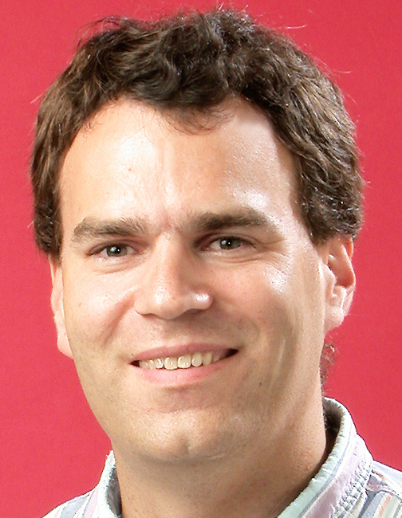

{.float-right width="150"}

### Position

-   Postdoctoral Researcher, Perimeter Institute for Theoretical Physics

### Background

-   Imperial College London
-   Hamilton College
-   Max Planck Institute for Gravitational Physics (Albert Einstein
    Institute)

### Research

-   Causal Set Quantum Gravity
-   Loop Quantum Gravity
-   Cactus
-   Numerical Relativity

The main thrust of my research program involves using high performance
computing and the Cactus framework to address questions in discrete
quantum gravity.

[More details available at my main
page](http://www.phy.syr.edu/~rideout/)
