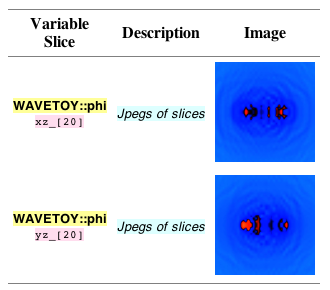

To find information on how to set up the WaveToy demo to work with your
installation of Cactus, read through our comprehensive
[tutorial](/documentation/tutorials/wavetoydemo/). To see WaveToy in
action, continue to the [live WaveToy
demonstration](http://cactuscode.org:8080/).

  

#### Viewport example screenshot:

  

