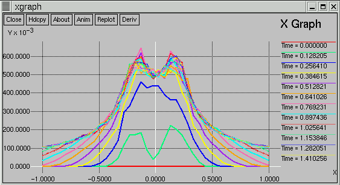
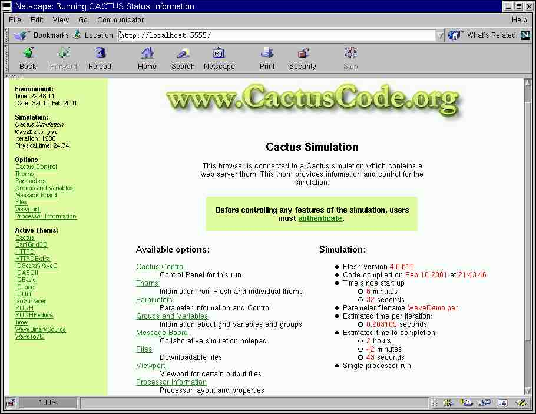
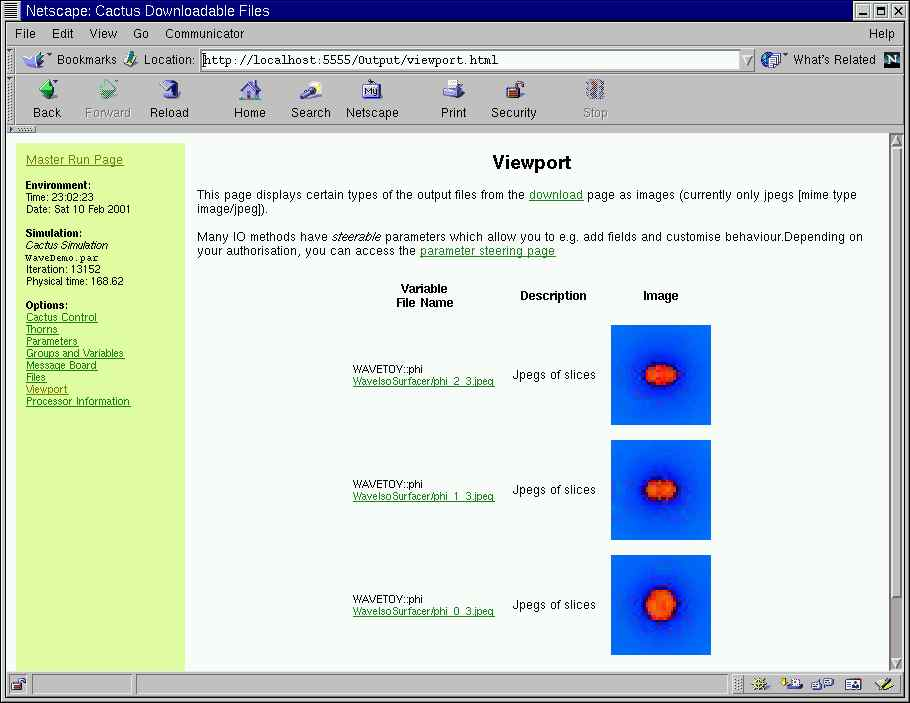
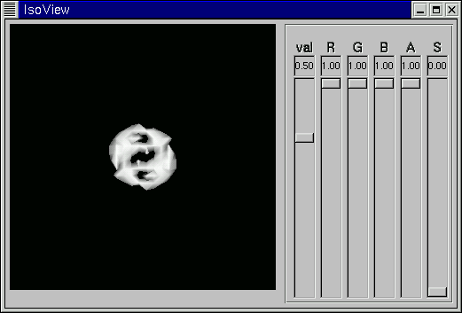
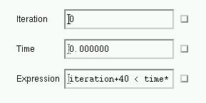
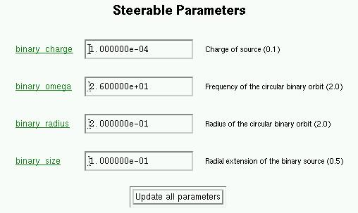
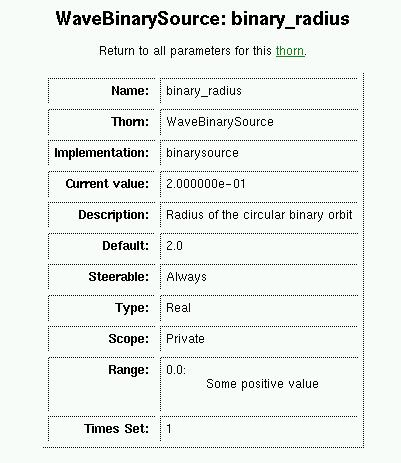
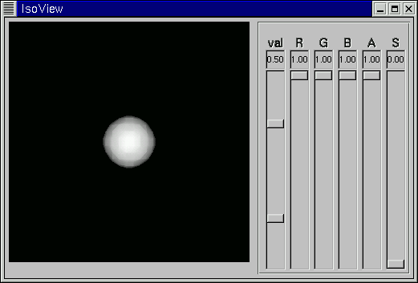


Connect to our [Cactus Demo](http://www.cactuscode.org:8080/) to see the
simple WaveToy example in action.

Note: This tutorial is, at least in parts, too old and needs an update
----------------------------------------------------------------------

Setting up the WaveToy Demo
---------------------------

In this tutorial, through the use of the WaveToy example we describe:

-   Compiling and running a simple Cactus application
-   Remote monitoring and steering of an application from any web
    browser
-   Streaming of isosurfaces from a simulation, which can then be viewed
    on a local machine
-   Remote visualization of 2D slices from any grid function in a
    simulation as JPEGs in a web browser

If you are new to Cactus or haven't used some of these tools before,
this is a good example to try. Note that you need a C compiler and about
50 MB of free disk space.

WaveToy simulates a 3D scalar field produced by two orbiting sources.
The solution is found by finite-differencing a hyperbolic partial
differential equation for the scalar field. Though this is a very simple
application, it is representative of a large class of more complex
systems including those described by Einstein's Equations, Maxwell's
Equations, and the Navier-Stokes Equations. We use it for demonstration
since the simulation is graphical, computationally inexpensive, robust,
has simple parameter choices.

Here we do not describe how to checkout and compile this Cactus application.
For this, see the primer on the [Download]({{base}}/download/index.html) page,
the [HOWTOs]({{base}}/documentation/tutorials/index.html) or the [User's
Guide]({{base}}/documentation/guides/index.html). We assume that you are
checking out Cactus using CVS and that you have the configuration options set
up. If you don't, hopefully the default configuration will work for you!

Demo with Web Server and Streaming IsoSurfaces
----------------------------------------------

### Check out and compile

Check out the source code using the **GetComponents** script.
`wget --no-check-certificate https://raw.github.com/gridaphobe/CRL/ET_2014_11/GetComponents chmod 755 GetComponents ./GetComponents http://cactuscode.org/documentation/tutorials/wavetoydemo/WaveDemo.th`

Once the checkout has completed, move into the Cactus directory and
compile the application.
` cd Cactus gmake WaveDemo-config gmake WaveDemo` Hopefully there were
no errors and you now have an executable, `exe/cactus_WaveDemo`.
Check that it worked by running the test suites. Type:
`gmake WaveDemo-testsuite` and give the default answers to each
question.

### Run the demo

Download the demo parameter file:
`wget http://www.cactuscode.org/documentation/tutorials/wavetoydemo/WaveDemo.par`

To start the simulation, run your new executable with the demo parameter
file. If you have a single processor, execute:
`./exe/cactus_WaveDemo WaveDemo.par`

If you compiled with MPI and have a multiprocessor version, you need to
use the appropriate MPI command for running.

When the simulation starts, you will see output describing the activated
thorns and the scheduling tree.
`tg-c305 dstark/Cactus> ./exe/cactus_WaveDemo parfiles/WaveDemo.par  --------------------------------------------------------------------------------         10                                     1   0101       ************************     01  1010 10      The Cactus Code V4.0      1010 1101 011      www.cactuscode.org        1001 100101    ************************       00010101                                     100011     (c) Copyright The Authors         0100      GNU Licensed. No Warranty         0101                                   --------------------------------------------------------------------------------  Cactus version: 4.0.b15 Compile date:   Nov 19 2004 (08:52:01) Run date:       Nov 19 2004 (08:54:30) Run host:       tg-c305.ncsa.teragrid.org Executable:     /home/ac/dstark/Cactus/./exe/cactus_WaveDemo Parameter file: parfiles/WaveDemo.par --------------------------------------------------------------------------------  Activating thorn Cactus...Success -> active implementation Cactus Activation requested for  --->coordbase symbase pugh pughslab pughreduce isosurfacer iojpeg jpeg6b ioutil ioascii iobasic time wavetoyc cartgrid3d boundary idscalarwavec wavebinarysource  httpd httpdextra socket<--- Activating thorn boundary...Success -> active implementation boundary Activating thorn cartgrid3d...Success -> active implementation grid Activating thorn coordbase...Success -> active implementation CoordBase Activating thorn httpd...Success -> active implementation HTTPD Activating thorn httpdextra...Success -> active implementation http_utils    . . .  Activating thorn wavebinarysource...Success -> active implementation binarysource Activating thorn wavetoyc...Success -> active implementation wavetoy --------------------------------------------------------------------------------   if (recover initial data)     Recover parameters   endif    Startup routines     [CCTK_STARTUP]     CartGrid3D: Register GH Extension for GridSymmetry     CoordBase: Register a GH extension to store the coordinate system handles     GROUP HTTP_Startup: HTTP daemon startup group       HTTPD: Start HTTP server       GROUP HTTP_SetupPages: Group to setup stuff which needs to be done           between starting the server and the first time it serves pages       HTTPD: Serve first pages at startup     HTTPDExtra: Utils for httpd startup     PUGH: Startup routine     IOUtil: Startup routine     IOJpeg: Startup routine     IOASCII: Startup routine     IsoSurfacer: Startup routine     IOBasic: Startup routine     PUGHReduce: Startup routine     SymBase: Register GH Extension for SymBase     WaveToyC: Register banner    . . .    Termination routines     [CCTK_TERMINATE]     IsoSurfacer: Termination routine     PUGH: Termination routine    Shutdown routines     [CCTK_SHUTDOWN]     HTTPD: HTTP daemon shutdown    Routines run after restricting:     [CCTK_POSTRESTRICT]     WaveToyC: Boundaries of 3D wave equation     GROUP WaveToyC_ApplyBCs: Apply boundary conditions       GROUP BoundaryConditions: Execute all boundary conditions         Boundary: Apply all requested local physical boundary conditions         CartGrid3D: Apply symmetry boundary conditions       Boundary: Unselect all grid variables for boundary conditions    Routines run after changing the grid hierarchy:     [CCTK_POSTREGRID]     CartGrid3D: Set Coordinates after regridding -------------------------------------------------------------------------------- Server started on http://tg-c305.ncsa.teragrid.org:5555/ INFO (what): PUGHReduce -------------------------------------------------------------------------------- Driver provided by PUGH -------------------------------------------------------------------------------- WaveToyC: Evolutions of a Scalar Field --------------------------------------------------------------------------------  INFO (IOJpeg): I/O Method 'IOJpeg' registered: output of 2D jpeg images                 of grid functions/arrays INFO (IOJpeg): Periodic IOJpeg output every 10 iterations INFO (IOJpeg): Periodic IOJpeg output requested for 'WAVETOY::phi' INFO (IOASCII): I/O Method 'IOASCII_1D' registered: output of 1D lines of                  grid functions/arrays to ASCII files INFO (IOASCII): Periodic 1D output every 10 iterations INFO (IOASCII): Periodic 1D output requested for 'WAVETOY::phi'    . . .  INFO (IsoSurfacer): Isosurfacer listening for connections      host 'tg-c305.ncsa.teragrid.org' control port 7050 data port 7051    . . .  INFO (PUGH):   Local load: 64000   [40 x 40 x 40] INFO (PUGH):   Maximum load skew: 100.000000 INFO (Time): Timestep set to 0.00649351 (courant_static) INFO (IOBasic): Periodic scalar output requested for 'WAVETOY::phi' INFO (IOBasic): Periodic info output requested for 'WAVETOY::phi' -------------------------------------------------    it  |          | WAVETOY::phi                |        |    t     | minimum      | maximum      | -------------------------------------------------      0 |    0.000 | 5.148200e-131 |   0.95066004 |     10 |    0.065 |-1.319022e-33 |   0.98026627 |     20 |    0.130 |  -0.30418278 |   1.40297645 |     30 |    0.195 |-9.120612e-23 |   1.53352239 |     40 |    0.260 |-4.980518e-19 |   1.76419451 |     50 |    0.325 |-5.650478e-16 |   2.06547404 |     60 |    0.390 |-5.221892e-13 |   2.20300711 |     70 |    0.455 |-3.124912e-10 |   2.39674767 |     80 |    0.519 |-9.294138e-09 |   2.38699930 |     90 |    0.584 |  -0.00000002 |   2.38045481 |    100 |    0.649 |-9.382595e-09 |   2.37422575 |    . . .`

This may take a while. You can look at the 1D output when it is finished
if you have the simple visualization client
[xgraph](http://cactuscode.org/documentation/visualizations/xgraph).
After downloading and installing xgraph, issue:
`xgraph WaveDemo/phi_x_[20][20].xg`

### Connecting with a web browser

To connect to the simulation, move to another machine and start up a web
browser. Connect to **http://&lt;machine name&gt;:5555** where
**&lt;machine name&gt;:5555** is the name of the machine where the
simulation is running. Note that this information was part of the
standard output when the simulation started. For example:
`Server started on http://tg-c305.ncsa.teragrid.org:5555/`

Now you should see a screen with information about the simulation.

Click through the links to find information about the thorns, parameters
and variables you are using. Go to the ViewPort to see JPEG images from
the simulation. If you press the refresh button on your browser these
will update. Go to the Files page and see some of the output files that
are being created. (If you have xgraph installed on your machine you can
set up your browser to automatically view these when you click on them.
See the
[WebBrowser-HOWTO]({{base}}/documentation/tutorials/WebBrowser-HOWTO.txt) for
more details).

### Viewing IsoSurfaces

Download
[IsoView]({{base}}/documentation/guides/visualization/IsoView/index.html), the
isosurface visualization client.

Start up IsoView: `IsoView -h <machine name> -dp 7051 -cp 7050`

Again, this information can be found in the standard output, for example

`INFO (IsoSurfacer): Isosurfacer listening for connections                    host 'GridRebels-MacBook-Pro.local' control port 7050 data port 7051`

You should now see rotating blobs appearing in the client which should
look something like this:

If you move the **val** slider, the value of the isosurface you see will
change. Also, if you move the cursor in the main window, holding down
the left, middle and right mouse buttons, the surface will rotate,
translate and zoom, respectively.

### Steering the Simulation

The web interface can also be used to control the simulation and steer
parameter values. Click on the **Cactus Control** link in the menu and
enter the user ID *anon* and password *anon* (you can set these to be
different values in the parameter file). Now you can pause, run or kill
the simulation using the top buttons. If you are using the IsoView
client, press pause. The blobs stop rotating:

The buttons at the bottom allow you to pause the simulation at a given
iteration number, a given time, or when a condition is true. This is
just the first version of a control interface; we hope it will become
much more powerful and include many interactive debugging and
collaborative tools.

To steer simulation parameters, select Parameters from the menu, and
then WaveBinarySource. We will change the parameter `binary_radius`,
which sets the distance between the orbiting sources. Note that the
parameters are divided into two sections, depending on whether they are
steerable or not. This is decided by the thorn author.

Note that if you click on a parameter name, you get all the known
information about that parameter.

Steer the parameter by changing the value in the box to 0 and pressing
the update button. If you are watching the isosurfaces, you should see
the blobs move together. This can take a while since the isosurfaces are
of the field and not the sources and the field takes time to catch up.

