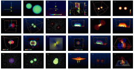
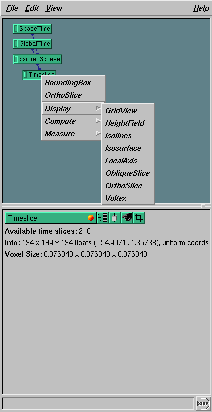

### Amira: ZIB\'s Advanced 3D Visualization System

[Amira](http://amira.zib.de/) is a research software package for the
development of new advanced high-end visualization methods, developed by
the [visualization department](http://www.zib.de/Visual/) of the
[Konrad-**Z**use-Center](http://www.zib.de) for **I**nformation
Techniques **B**erlin(ZIB).

Amira can be used to view 3D data of scalar fields, vector fields,
tensor fields, apparent horizon multipole expansions and gaussian
curvature data, embedding coefficients, remotely computed isosurfaces
(similarly to [IsoView](../IsoView/)), geodesics, and more. For remote
visualization a remote control interface for steering Cactus simulations
is also available.

-   [Obtaining](#download)
-   [Using](#using)
-   [Support](#support)

[]{#download}

### Obtaining Amira

+-----------------------------------+-----------------------------------+
|                                   | **Demo Version**\                 |
|                                   | A free time-limited, but          |
|                                   | renewable demo version is         |
|                                   | available for [downloading from   |
|                                   | ZIB](http://amira.zib.de/download |
|                                   | /)                                |
|                                   | after registration. In addition   |
|                                   | you need the (free) Numerical     |
|                                   | Relativity extension for handling |
|                                   | Cactus data.                      |
|                                   |                                   |
|                                   | **Commercial Version**\           |
|                                   | [Amira](http://www.amiravis.com/) |
|                                   | is distributed commercially       |
|                                   | through [Template Graphics        |
|                                   | Software](http://www.tgs.com).    |
|                                   | Please enquire at this site for a |
|                                   | fully qualified version.          |
|                                   |                                   |
|                                   | **Special Arrangements for        |
|                                   | Cooperation Partners**\           |
|                                   | Special arrangements can be       |
|                                   | established for partners          |
|                                   | contributing to the Amira         |
|                                   | development process. Cooperation  |
|                                   | partners may receive renewable    |
|                                   | free updates of the internal      |
|                                   | development version of Amira      |
|                                   | including the newest features and |
|                                   | bugfixes.                         |
+-----------------------------------+-----------------------------------+

[]{#using}

### Using Amira

+-----------------------------------+-----------------------------------+
|                                   | Amira is designed for an end-user |
|                                   | who has minimal experience with   |
|                                   | visualization tools, meaning that |
|                                   | anything deemed untrivial is      |
|                                   | considered to be too complicated  |
|                                   | and should be treated as a bug.   |
|                                   |                                   |
|                                   | Amira provides a kind of          |
|                                   | visualization network, which      |
|                                   | graphically displays the current  |
|                                   | settings and relationships among  |
|                                   | the visualization components. In  |
|                                   | contrast to other tools like AVS  |
|                                   | or IBM DX, you don\'t see a       |
|                                   | (possibly complicated) data flow  |
|                                   | diagram, instead the data is      |
|                                   | directly displayed as (green)     |
|                                   | icons and the appropriate         |
|                                   | displays pop up from right-mouse  |
|                                   | button clicks on the green icons. |
|                                   |                                   |
|                                   | **Predefined Networks             |
|                                   | **                    |
|                                   |                                   |
|                                   | While it is easy, with only a     |
|                                   | little experience, to construct   |
|                                   | simple visualization networks     |
|                                   | from scratch, a couple of         |
|                                   | \`standard\' visualization        |
|                                   | networks which arise in every-day |
|                                   | work with Cactus data are         |
|                                   | predefined. To get a list of all  |
|                                   | these (daily growing) list of     |
|                                   | networks, simply issue            |
|                                   |                                   |
|                                   | `          `                      |
|                                   |                                   |
|                                   |     amira2000 '+?'                |
|                                   |                                   |
|                                   | on the command line. This will    |
|                                   | print a list of available         |
|                                   | networks and, for example,        |
|                                   | starting Amira with `         `   |
|                                   |                                   |
|                                   |     amira2000 +remoteviz          |
|                                   |                                   |
|                                   | will launch Amira ready for       |
|                                   | retrieving data from a [remote    |
|                                   | simulation](http://www.zib.de/geo |
|                                   | desics/).                         |
|                                   |                                   |
|                                   |  **Working with 3D     |
|                                   | data**                            |
|                                   |                                   |
|                                   | As an example of looking at some  |
|                                   | data set, for example 3D data in  |
|                                   | FlexIO format written by Cactus,  |
|                                   | simply invoke Amira with the      |
|                                   | appropriate filename, e.g.        |
|                                   |                                   |
|                                   | `         `                       |
|                                   |                                   |
|                                   |     amira2000 psi0re_3d.ieee      |
|                                   |                                   |
|                                   | Note that large datasets beyond   |
|                                   | the 2GB limit are supported and   |
|                                   | can be handled, conveniently      |
|                                   | fast, with on-demand loading      |
|                                   |                                   |
|                                   | A green data icon will appear,    |
|                                   | named according to the file name. |
|                                   | From that, use the right-mouse    |
|                                   | button to select a \`timeslice\'  |
|                                   | data set, for which a number of   |
|                                   | visualization modules can be      |
|                                   | applied.                          |
+-----------------------------------+-----------------------------------+

[]{#support}

### Support

+-----------------------------------+-----------------------------------+
|                                   | Amira is used by the following    |
|                                   | projects (as part of a ZIB-AEI    |
|                                   | cooperation):                     |
|                                   |                                   |
|                                   | [**ART                            |
|                                   | Project**](http://www.zib.de/visu |
|                                   | al/projects/ART/)                 |
|                                   | - Visualization of General        |
|                                   | Relativity                        |
|                                   |                                   |
|                                   | [**AMR                            |
|                                   | Project**](http://www.zib.de/visu |
|                                   | al/projects/amr/amr.en.html)      |
|                                   | - Visualization of Hierarchical   |
|                                   | Datasets                          |
|                                   |                                   |
|                                   | [**TIKSL                          |
|                                   | Project**](http://www.zib.de/visu |
|                                   | al/projects/TIKSL/)               |
|                                   | - Remote Visualization            |
|                                   |                                   |
|                                   | [**GriKSL                         |
|                                   | Project**](http://www.griksl.org) |
|                                   | - Remote Visualization            |
|                                   |                                   |
|                                   | Please write to the individual    |
|                                   | peoples associated with these     |
|                                   | projects with specific questions, |
|                                   | or write to <amira@zib.de> for    |
|                                   | general inquiries.                |
+-----------------------------------+-----------------------------------+
