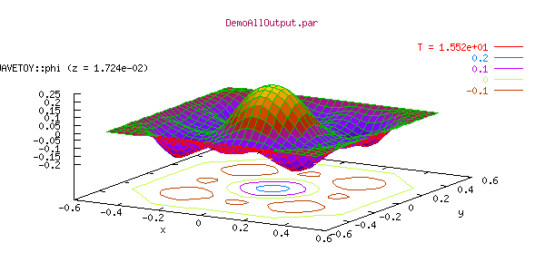

<h3 id="gnuplot---powerful-visualization-tool-for-1d-and-2d-data">Gnuplot - Powerful Visualization Tool for 1D and 2D Data</h3>
<a href="gnuPlot1.gif"></a> 

Gnuplot is a command-driven interactive function plotting program. It can plot functions and data points in both two- and three-dimensional plots in various formats (points, lines, surfaces, contours). A set of built-in terminal drivers support many different graphics devices, eg. for plotting to different types of terminals or for generating GIF, postscript, latex files.

Gnuplot is free software. It is available on a variety of platforms and architectures.

The gnuplot home page <a href="http://www.gnuplot.info">www.gnuplot.info</a> provides the latest official release, along with documentation, a FAQ list, and links to more information. Gnuplot development is managed by SourceForge. The latest development source code version can be checked out on the <a href="http://sourceforge.net/projects/gnuplot/">SourceForge CVS page for gnuplot</a>. The SourceForge ftp server also contains <a href="ftp://gnuplot.sourceforge.net/pub/gnuplot/">development tarballs with source code and binaries</a> of the most recent stable gnuplot version.<br />
Since in many software distributions only an older version of gnuplot is included, we provide <a href="http://jean-luc.aei.mpg.de/Codes/gnuplot/">statically linked Linux executables of gnuplot 4.0.0</a> (with mouse support for rotating/scaling/zooming and pm3d support for drawing color/gray maps and surfaces).

<h3 id="using-gnuplot-with-cactus">Using gnuplot with Cactus</h3>
**Erik Schnetter**

**June 17, 2001**

<h3 id="abstract">Abstract:</h3>
At the time of this writing, there are two supported client programmes available to display Cactus ASCII output graphically, namely <a href="../xGraph">*xgraph*</a> and *gnuplot*. Although xgraph is the default output format, gnuplot offers many more features to the intermediate and expert user. Among those are the capability to choose which part(s) of the dataset to display, or to combine with other data. Below you find an introduction to creating and viewing Cactus ASCII output files in the gnuplot format. Step by step you are then introduced to more advanced features of gnuplot.

<h2 id="contents"><span id="SECTION1">Contents</span></h2>
<ul>
<li><a href="gnuPlot" id="tex2html19">Contents</a></li>
<li><a href="gnuPlot#SECTION2" id="tex2html20">1. Choosing gnuplot output in Cactus</a></li>
<li><a href="gnuPlot#SECTION3" id="tex2html21">2. Producing some example files</a></li>
<li><a href="gnuPlot#SECTION4" id="tex2html22">3. First steps</a></li>
<li><a href="gnuPlot#SECTION5" id="tex2html23">4. Brushing up the graphs</a>
<ul>
<li><a href="gnuPlot#SECTION51" id="tex2html24">4.1. Comfortable input</a></li>
<li><a href="gnuPlot#SECTION52" id="tex2html25">4.2. Basic "set" options</a></li>
<li><a href="gnuPlot#SECTION53" id="tex2html26">4.3. Combining several graphs</a></li>
<li><a href="gnuPlot#SECTION54" id="tex2html27">4.4. Saving the output / Printing</a></li>
</ul></li>
<li><a href="gnuPlot#SECTION6" id="tex2html28">5. Plotting 2D output files</a></li>
<li><a href="gnuPlot#SECTION7" id="tex2html29">6. Getting professional</a></li>
<li><a href="gnuPlot#SECTION8%22" id="tex2html30">7. Some advanced options</a>
<ul>
<li><a href="gnuPlot#SECTION81" id="tex2html31">7.1. Downsampling</a></li>
<li><a href="gnuPlot#SECTION82" id="tex2html32">7.2. Rescaling</a></li>
<li><a href="gnuPlot#SECTION83" id="tex2html33">7.3. Scripting</a></li>
</ul></li>
<li><a href="gnuPlot#SECTION9" id="tex2html34">8. 3D plots of time evolutions</a></li>
<li><a href="gnuPlot#SECTION10" id="tex2html35">9. Closing remarks</a></li>
</ul>
<h1 id="choosing-gnuplot-output-in-cactus"><span id="SECTION2">1. Choosing gnuplot output in Cactus</span></h1>
By default, the thorns IOBasic and IOASCII produce xgraph output. You have to set the parameters

```
IOBasic::outScalar_style = "gnuplot"
IOASCII::out1D_style = "gnuplot f(x)"
```
to get gnuplot output. The basic file contents will be the same, but the file will have a slightly different structure.

<h1 id="producing-some-example-files"><span id="SECTION3">2. Producing some example files</span></h1>
By default, 1D ASCII output from the released Cactus thorns uses xgraph format, and most of the example parameter files distributed with thorns follow this convention. The parameter file *wavetoyc_gnuplot.par* in thorn **WaveToyC** in the **CactusWave** arrangement produces gnuplot output, demonstrating all released output methods which can produce gnuplot output. To test this out:

1. Create an application `wavetoy` consisting of the standard WaveToy example
1. Type `make wavetoy-examples` to get some sample parameter files in the directory `examples/wavetoy`
1. Run the parameter file *wavetoyc_gnuplot.par*
You should now have an output file called `phi.xl`. If you look into this file, you should see some hash characters (`#`) and no lonely double quotes. Hash characters are used in gnuplot files, while lonely double quotes are used in xgraph files.

<h1 id="first-steps"><span id="SECTION4">3. First steps</span></h1>
If gnuplot is not already installed on your machine, either ask your system administrator to install it, or follow the download/installation instructions below. The current version of gnuplot is about 3.7. (Earlier versions might not support all of the commands mentioned below.) You start gnuplot by typing `gnuplot` in a terminal. You will see a long banner of about 20 lines, and then the prompt `gnuplot>`. Gnuplot is terminal-driven -- that means that you have to type your commands.

While in gnuplot you can change directories using the `cd` command much like you do in your shell. The difference is that the directory name has to be enclosed in double quotes. So, if you are not already in the directory containing the output files, go there now.

The basic gnuplot command is `plot`. You can plot functions (`plot sin(x)`) and files. To plot phi vs. x, you'd say

```
plot "phi.xl" with lines
```
You will see phi plotted vs. x. Each curve is for one time step. In order to choose a particular time only, you say

```
plot "phi.xl" index 10 with points
```
where "`index 10`" selects the 10th output (numbering starts from zero). The general form of the "`index`" option is "`index  FROM:TO:STRIDE`", so that the command

```
plot "phi.xl" index 10:20:5 with linespoints
```
plots the 10th, 15th, and 20th output with connected points. Note that you cannot change the relative order of the "`index`" and "`with`" options; the `index` option has to come before `with`.

You can zoom in by specifying ranges in the x and y direction, as with

```
plot [0:2][-0.25:] "phi.xl" index 10:20:5 with linespoints
```
which chooses the range [0:2] for the x axis and [-0.25:YMAX] for the y axis. ymax is automatically determined through the data you plot.
You get help with "`help`", especially with "`help plot`".

You quit gnuplot with "`quit`".

<h1 id="brushing-up-the-graphs"><span id="SECTION5">4. Brushing up the graphs</span></h1>
<h2 id="comfortable-input"><span id="SECTION51">4.1 Comfortable input</span></h2>
You noticed likely that, once you typed a command, the next command is often very similar. Instead of retyping the whole command, you can use the cursor keys to get to what you typed previously and edit that command. This is in general much faster. If your cursor keys don't work (i. e. if they only produce strange characters on your screen), then gnuplot has not been set up correctly. Contact your system administrator; this is a serious flaw that will greatly hinder your productivity.

<h2 id="basic-set-options"><span id="SECTION52">4.2 Basic "set" options</span></h2>
Gnuplot has many options that can be set using the "`set`" command:

- You can add a coordinate grid to you plots with "`set grid`". You have to enable the grid before you execute the plot command. You switch off the grid with "`set nogrid`". Most options have a corresponding "`no`"-options.
- You can add a title with "`set title TITLE`". Your title TITLE has to be enclosed in double quotes. See also "`help set title`".
- You can permanently set the x and y ranges with "`set xrange [min:max]`" and "`set yrange  [min:max]`". You get rid of these ranges with "`set autoscale x`" and "`set autoscale y`".

<h2 id="combining-several-graphs"><span id="SECTION53">4.3 Combining several graphs</span></h2>
Sometimes you want to plot several graphs on top of each other. In order to do that, you use a single plot command and separate the plot options by commas, as in

```
plot "phi.xl" index 0 with lines, "phi.xl" index 10 with lines
```
Notice that you get different colours that way. You can specify which colours to use by adding a number after the plotting style, as in "`with points 4`", "`with lines 7`", "`with dots 8`". You can get a test page listing all colours by giving the "`test`" command.

If you want different labels for the different graphs that you combine, say

```
plot "phi.xl" index 0 title "initial" with lines, "phi.xl" index 60 title "final" with lines
```
(on a single line, of course). Again the order of "index", "title", and "with" cannot be changed.

<h2 id="saving-the-output-printing"><span id="SECTION54">4.4. Saving the output / Printing</span></h2>
After that much work you will likely want to print your work. Gnuplot can output in many different formats; your screen is only one of them. To produce postscript output and write that into a file, you would first come up with the corresponding "`plot`" command. Then you say

1. `set output "phi.ps"`
1. `set terminal postscript color` [notice the American spelling of "color" here]
1. `plot ...` [using your cursor keys to repeat a previous command, of course]
1. `set output` [finish writing into the file]
1. `set terminal x11` [plot to the screen again]

You can plot several graphs into the same file by giving several "`plot`" commands. They will be placed onto different pages.

Colours and line styles might come out differently on the screen and on paper. You might want to output a test page (say "`test`" instead of "`plot ...`" in the above). In order to produce black-and-white graphs, leave out the "`color`" option in the "`set terminal postscript`" specification.

<h1 id="plotting-2d-output-files"><span id="SECTION6">5. Plotting 2D output files</span></h1>
Cactus can not only output 1D ASCII files, but also 2D files. These files contain a whole plane of data. You enable this kind of output by setting the corresponding "2D" parameters in your Cactus parameter file. For example, you could add the lines

```
IOASCII::out2D_every = 2
IOASCII::out2D_vars = "wavetoy::phi"
```
to the WaveToy parameter file from above that you used to create the 1D output.

The basic gnuplot command for 2D-plots (aka surface plots) is "`splot`". Thus

```
splot "phi_2d_xy.gnuplot" index 0 with lines
```
works as expected. "`splot`" accepts the same "`index`", "`with`", and "`title`" options as "`plot`". Do not forget about "`help splot`". [Old versions of gnuplot might need a "`set parametric`" before they can plot surfaces. Install a current version if that happens to you.]

You can remove the hidden lines, i. e. make the surface non-transparent, with the option "`set hidden3d`". After setting that option you have to replot the graph.

For surface plots there are three ranges that you can specify, namely x, y, and z. So

```
splot [6:][6:] "phi_2d_xy.gnuplot" index 60 with lines
```
selects the outermost corner for displaying, while

```
splot [6:][6:][-0.1:+0.1] "phi_2d_xy.gnuplot" index 60 with lines
```
also chooses a different (much coarser) scale on the z axis.

You can add contour lines to your graph with "`set contour`". As "`help set contour`" tells you, you can draw the contour lines onto the x-y plane ("`set contour base`"), onto the graph ("`set contour surface`"), or both ("`set contour both`"). You can even switch off the surface ("`set nosurface`") and display the contour lines alone.

You get back to normal with "`set nocontour`" and "`set surface`".

You can rotate the graph with "`set view`". See "`help set view`" for details.

<h1 id="getting-professional"><span id="SECTION7">6 Getting professional</span></h1>
Many people love their keyboards so much that they are hesitant to type more characters than absolutely necessary. Fortunately for them, most gnuplot commands can be abbreviated. Instead of the cumbersome

```
plot "phi.xl" index 0 title "initial" with lines, "phi.xl" index 60 title "final" with lines
```
from above, you can also write

```
p "phi.xl" i 0 t "initial" w l, "" i 60 t "final" w l
```
Most commands and options are abbreviated by their first or first few characters. An empty file name repeats the previous file name. "`linespoints`", by the way, is abbreviated "`lp`".

If you want to create gnuplot scripts, then you can put these commands into a file and then execute that file with "`load FILENAME`". Your FILENAME has to be put in double quotes. Your file can contain empty lines, and comments introduced by the hash ("`#`") character.

You can also save your current gnuplot state (including all the "`set`" options currently in effect) with the "`save FILENAME`" command. You can then load this state again with "`load FILENAME`".

<h1 id="some-advanced-options"><span id="SECTION8">7. Some advanced options</span></h1>
<h2 id="downsampling"><span id="SECTION81">7.1 Downsampling</span></h2>
If you have high resolution data, you might want to plot only every n-th data point:

```
plot "phi.xl" index 0 every 2 with linespoints
splot "phi_2d_xy.gnuplot" index 0 every 2:2 with lines
```
The "`every 2`" and "`every 2:2`" display only every second grid point.

<h2 id="rescaling"><span id="SECTION82">7.2 Rescaling</span></h2>
You can rescale or shift the data:

`plot "phi.xl" index 0 using 1:($2*2) with linespoints`
The expression "`($2*2)`" multiplies all values in the second column ("`$2`") with 2 before it is displayed. You can put arbitrary expressions in a C-like syntax here, such as "`(sqrt($2*$2))`" for the absolute value, or "`(2*pi*$2)`" to multiply by 2 pi, or add a sine wave as in "`($2+sin($1))`". You can also modify the x coordinate. The whole formula has to be put in parentheses.

An expression that is sometimes useful is "`(test ? value : 0/0)`". It displays the value only if "`test`" is true. Otherwise the value is omitted from the graph.

<h2 id="scripting"><span id="SECTION83">7.3. Scripting</span></h2>
You can not only display files, but arbitrary output produced by other programmes. This is especially helpful to preprocess data files through scripts, e. g. using paste, awk, or perl. For reasons of space I will not describe using awk or perl here.

Assume that you want to plot the difference between the global minimum and maximum versus time (for whatever reason). You can easily plot the minimum and maximum themselves with

```
plot "phi_min.tl" with lines, "phi_max.tl" with lines
```
but combining values from different files into a single curve requires some magic: The line

```
plot "< paste phi_min.tl phi_max.tl" using 1:($4-$2) with lines
```
plots the desired difference. Gnuplot treats a filename that starts\ with "`<`" not as a regular file, but as a command that is executed. The output of that command is then plotted.

The Unix command "`paste`" takes its input files and concatenates their individual lines. The input files "`phi_min.tl`" and "`phi_max.tl`" have two columns each, thus the output of the paste command has four columns. The "`using`" option plots the first column (the time) versus the difference of the fourth and second column, i. e. the difference between the maximum and minimum. (The third column contains again the time.) See "`man paste`" in Unix and "`help plot special-filenames`" and "`help plot using`" in gnuplot.

<h1 id="d-plots-of-time-evolutions"><span id="SECTION9">8. 3D plots of time evolutions</span></h1>
It is often convenient to produce a 3D plot that shows how e. g. "`phi.xl`" evolves in time. A naive

```
splot "phi.xl" using 2 with lines
```
doesn't work -- all curves sit on top of each other instead of next to each other. An unhappy coincidence means that the gnuplot files produced by Cactus contain too many empty lines for that; it is necessary to remove every second empty line. This can be achieved with an awk script, as in

```
splot "< awk '{ if (NF==0) ++el; else el=0; if (el<2) print; }' phi.xl" using 2 with lines
```
In the above command (which has to be on a single line) be sure to get the quotes and apostrophes correct.

<h1 id="closing-remarks"><span id="SECTION10">9. Closing remarks</span></h1>
Gnuplot scales well. I have successfully used gnuplot with data files several hundred Megabytes large, on machines with much less main memory. I never had gnuplot crash on me.

Gnuplot is actively maintained and available on many platforms. The current beta versions allow mouse interactions with the graph, for example rotating a 3D image.

Gnuplot (together with the various scripting languages) is a very powerful tool. You can produce reasonable graphs with just a few commands, but there are many more than shown here in this introduction. The ability to write programmes and execute them later makes it easy to repeat previous work, should, hypothetically, any data files change just hours prior to a deadline. It also makes it less tedious to produce many similar graphs.

