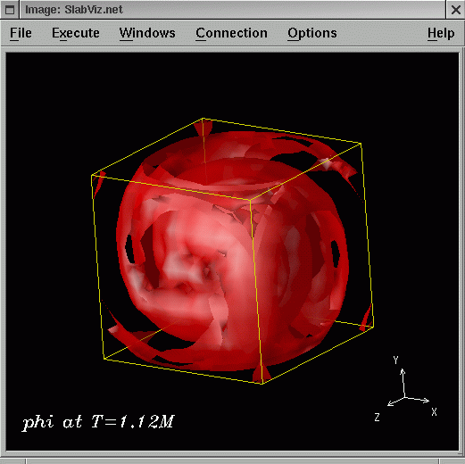
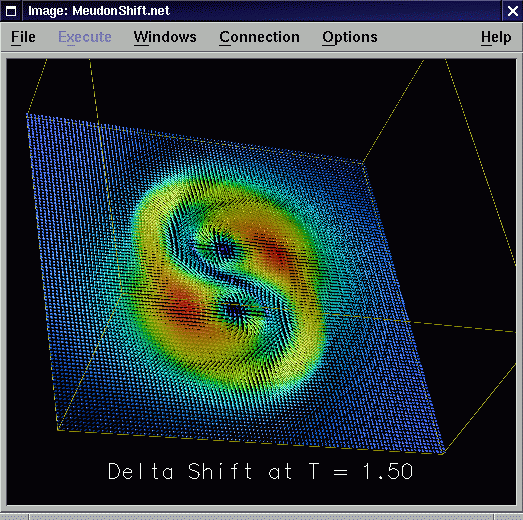

### What is OpenDX

OpenDX is the open source software version of [IBM's Visualization Data
Explorer Product](http://www.ibm.com/dx). OpenDX is a uniquely powerful,
full-featured software package for the visualization of scientific,
engineering and analytical data: Its open system design is built on a
standard interface environment. And its sophisticated data model
provides users with great flexibility in creating visualizations.

The official [OpenDX home page](http://www.opendx.org) should be visited
to get general information about OpenDX. There are links to a "Getting
Started" introduction into OpenDX, a gallery of OpenDX visualization
examples, a user and developer discussion forum, FAQs, support contacts,
and much more.

Similar to the visualization package AVS, OpenDX offers a data
flow-based programming environment. Modules are the basic components for
building a visualization application. There exist various module
categories of different functionality such as

-   Import and Export of data
-   Data Transformation
-   Rendering
-   Graphics output
-   Interactors
-   Flow Control
-   Debugging

A wide number of functional modules for each of the above categories is
already built into the DX server program as provided with the standard
distribution of OpenDX. Developers can also add their own, specialized
functionality as external modules to link against the OpenDX runtime
libraries and build their own server program. We are using this
mechanism to provide our own Data Import modules to read datafiles
written in HDF5 format.

  

### The OpenDXutils Package

Datafiles written in the HDF5 file format (as created by various I/O
methods in Cactus) cannot be read by one of the built-in OpenDX data
import modules. For that reason appropriate readers must be provided as
external OpenDX modules.

The OpenDXutils packages provides such readers as runtime-loadable
modules to be used in a standard installation of OpenDX. There are a
number of different reader modules available which can import different
types of data from HDF5 datafiles into an OpenDX visualization
application:

1.  [ImportHDF5](../Visualization/ImportHDF5)  
    reads arbitrary N-dimensional datasets from an HDF5 file on a local
    file system, from another application (eg. a running Cactus
    simulation) as streamed HDF5 files via a live socket connection, or
    from a remote HDF5 file located on a GridFtp server (see the
    [GridFtpVFD-HDF5](../Visualization/GridFtpVFD-HDF5) package for
    details on remote HDF5 file visualization).  
    Data can be imported as full datasets, or as slabs (orthogonal
    subregions within the full dataset, potentially with less than N
    dimensions, and defined by its origin, thickness, and stride
    parameters). The datasets in the HDF5 datafile are assumed to
    describe a regular grid.
2.  [ImportCactusHDF5](../Visualization/ImportCactusHDF5)  
    provides same functionality as
    [ImportHDF5](../Visualization/ImportHDF5), plus some extensions
    specific to import data from Cactus HDF5 datafiles.  
    This module is able to read distributed datasets from multiple
    chunked HDF5 output files (as usually created during a parallel
    Cactus run) directly, with transparent recombination on-the-fly.
3.  [ImportCarpetHDF5](../Visualization/ImportCarpetHDF5)  
    imports fixed mesh refinement datasets from an HDF5 file which was
    generated by [Carpet's](https://bitbucket.org/eschnett/carpet.git) IOFlexIO
    output method using CarpetIOHDF5 AMR Writer file format where many
    regular-shaped patches of different refinement levels can be
    arranged within multiple nested grids.  
    Like [ImportHDF5](../Visualization/ImportHDF5) and
    [ImportCactusHDF5](ImportCactusHDF5), this module can also read
    slabs of full FMR datasets.
4.  ImportAHFinderFile  
    reads HDF5 output files from the Cactus Apparent Horizon Finder
    thorn

### Downloading and Installing

For obtaining OpenDX you can go to the [OpenDX download
page](http://www.opendx.org/download.html) which provides pre-compiled
binaries for a number of architectures. If your architecture is not
among these, or the binary distribution doesn't work for you, you can
also download the sources and build OpenDX yourself. Please read the
README and INSTALL files in the source distribution and follow the
instructions given therein.  
You should also download the OpenDX examples which come as a separate
package and install these in the same directory as OpenDX.

The OpenDXutils package can be obtained from the Cactus CVS server via
anonymous checkout:

      cvs -d :pserver:cvs_anon@cvs.cactuscode.org:/cactus login    # password is 'anon'
      cvs -d :pserver:cvs_anon@cvs.cactuscode.org:/cactus checkout VizTools/OpenDXutils

The OpenDXutils package contains a `src/` subdirectory with the modules'
C source code files and the corresponding module description file
`ImportHDF5.mdf`. A Makefile is also supplied to build the
runtime-loadable module file.

In order to build the modules of the OpenDXutils package you need to
have HDF5 and a standard distribution of OpenDX installed on your
system. For details where to obtain and how to install HDF5 please refer
to the [Cactus HDF5 HOWTO Page](../Documentation/hdf5HowTo.txt).

Before starting to compile the modules the enviroment variable
`HDF5_DIR` must be set to point to your HDF5 installation (eg.
`/usr/local/apps/hdf5/`). You also need to set the `DXROOT` environment
variable to point to your OpenDX installation (eg.
`/usr/local/apps/dx-4.2.0/dx/` so that make can find the OpenDX header
files and libraries.  
The Makefile already defines the proper compiler and linker options, so
just by typing `make` in the `src/` subdirectory, a runtime-loadable
module file called `ImportHDF5` should be created which contains the
binary code of the HDF5 Data Import modules.  
**Note:** The Makefile determines the compiler and linker flags to use
from the underlying OpenDX installation's `$DXROOT/lib_<arch>/arch.mak`
file. The `dx-4.2.0` distribution of OpenDX has a bug in its
installation procedure which causes the `DX_RTL_LDFLAGS` makefile
variable not being expanded during installation. Until this bug is
fixed, the `arch.mak` file should be edited by hand in order to set the
`DX_RTL_LDFLAGS` variable properly. For OpenDX installations built with
the GNU C/C++ compilers, the corresponding line in the `arch.mak` file
should be changed into

      DX_RTL_LDFLAGS = --shared -Xlinker '-e DXEntry'

You should upgrade to `dx-4.3.0` - in this version the above described
bug has been fixed.

The OpenDXutils modules are dynamically loaded into the OpenDX server
program by telling it where to find the runtime-loadable module file and
the corresponding module description file. This is done by either
invoking OpenDX via:

      dx -mdf  <my_VizTools_dir>/OpenDXutils/src/ImportHDF5.mdf \
         -modules  <my_VizTools_dir>/OpenDXutils/src            \
         [ any other options to OpenDX ]

or, more easily, by setting the following two environment variables in
your shell startup file:

      # for csh/tcsh
      setenv DXMODULES  <my_VizTools_dir>/OpenDXutils/src
      setenv DXMDF      <my_VizTools_dir>/OpenDXutils/src/ImportHDF5.mdf

      # for bash
      DXMODULES=<my_VizTools_dir>/OpenDXutils/src
      DXMDF=<my_VizTools_dir>/OpenDXutils/src/ImportHDF5.mdf
      export DXMODULES
      export DXMDF

### Using OpenDX

Some example networks are contained in the `net/` subdirectory of the
OpenDXutils package, demonstrating the use of the HDF5 data import
modules. Before running any of the programs please make sure that you
change into this directory because they import data from an HDF5 sample
datafile located relative to that directory.

### Support and Acknowledgements

[Thomas Radke](http://www.aei.mpg.de/~tradke) is the main author and
maintainer of the OpenDXutils package. The development work has been
supported by the [Deutsches Forschungsnetz Verein](http://www.dfn.de)
through the [GriKSL project](http://www.griksl.org) under contract TK
602 - AN 200. Various people from the Cactus team, the [Numerical
Relativity Group](http://jean-luc.aei.mpg.de) at the
[Albert-Einstein-Institute](http://www.aei.mpg.de) and Eh Tan from the
[Computational Infrastructure for
Geodynamics](http://www.geodynamics.org) organization contributed to the
developemnt and enhancement of the package.  
Suggestions for the functional design and actual implementation of a
general HDF5 data import module resulted from discussions on the
<opendx-users@opendx.watson.ibm.com> mailing list. Useful hints were
taken from the [dxhdf5](http://www-beams.colorado.edu/dxhdf5) package
developed by Ireneusz Szczesniak from the University of Colorado at
Boulder.

Please report bugs and send any comments to the
[maintainer](mailto:tradke@aei.mpg.de) of the OpenDXutils package.

The software in the OpenDXutils package is available under the GNU
General Public License. In addition to the conditions in the GNU General
Public License, the authors strongly suggest **using this software for
non-military purposes only.**
