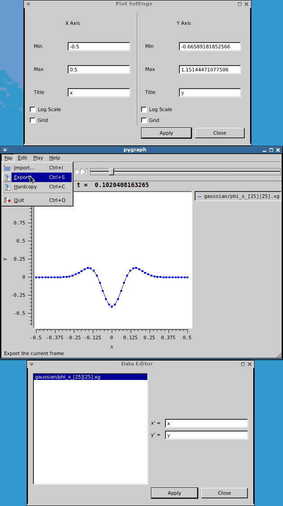


<h3 id="pygraph-animated-easy-client-for-1d-line-plots">pyGraph: Animated, Easy Client for 1D Line Plots</h3>
pyGraph is a freely available, lightweight and easy to use visualization client for viewing 1D data files which started out as a python re-implementation of <a href="../yGraph">yGraph</a>.. It includes features for animation, zooming and saving to png. (Also see the page for <a href="../yGraph">ygraph</a>.)

pyGraph was developed by David Radice. The source code can be obtained from the Mercurial repository <a href="https://bitbucket.org/dradice/pygraph/">https://bitbucket.org/dradice/pygraph/</a>. pyGraph relies on <a href="https://bitbucket.org/dradice/scidata/">https://bitbucket.org/dradice/scidata/</a> to read in Cactus data files.


- <a href="#getting-hold-of-pygraph">Download</a>
- <a href="#using-pygraph">Using</a>
- <a href="#support">Support</a>

<a href="pyGraph.png"></a>

<h3 id="using-pygraph">Using pyGraph</h3>
pyGraph can be used to view one or multiple 1D data files with the format

```
"Time=0.0
0.0  0.0
0.2  0.04
0.4  0.16
0.6  0.36
0.8  0.64
1.0  1.0

"Time=1.0
0.0  0.0
0.2 -0.04
0.4 -0.16
0.6 -0.36
0.8 -0.64
1.0 -1.0
```

Such files can be created with the Cactus thorns `CactusBase/IOASCII` and `CactusBase/IOBasic`

Viewing files is as easy as typing

```
ygraph <data filename> <data filename>
```

The are several options for customising aspects of and using ygraph, a manpage can be built from the source, or type `pygraph --help` for more information.

If you are using thorn `CactusConnect/HTTPD` you can setup your browser to automatically view any advertised ygraph files. Instructions on how to do this are provided in the <a href="{{base}}/documentation/tutorials/webServerHowTo.txt">WebServer-HOWTO</a>.


<h3 id="getting-hold-of-pygraph">Getting Hold of pyGraph</h3>
Binaries and source code for ygraph are all available from the <a href="https://bitbucket.org/dradice/pygraph/">pyGraph mercurial repository</a>.

<h3 id="installation">Installation</h3>
pyGraph requires the following packages to be available


- PyQt-5, including its development tools for pyrcc4
- PythonQwt

which can be installed using your system's package manager or via pip

```
pip install --user PyQt5
pip install --user pyqwt
```

Once those are installed pygraph and its scidata depency can be installed using pip
```
pip install --user git+https://bitbucket.org/dradice/scidata
pip install --user git+https://bitbucket.org/dradice/pygraph
```

<h3 id="support">Support</h3>
Please direct questions about pyGraph to its bitbucket ticket page <a href="https://bitbucket.org/dradice/pygraph/issues">https://bitbucket.org/dradice/pygraph/issues</a>

