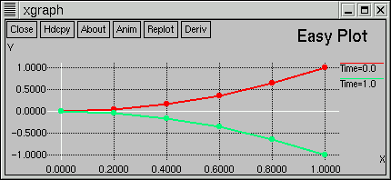


<table>
<colgroup>
<col style="width: 100%" />
</colgroup>
<tbody>
<tr class="odd">
<td><h3 id="xgraph-animated-easy-client-for-1d-line-plots">xgraph: Animated, Easy Client for 1D Line Plots</h3>
<table>
<colgroup>
<col style="width: 50%" />
<col style="width: 50%" />
</colgroup>
<tbody>
<tr class="odd">
<td>
xgraph is a freely available, lightweight and easy to use visualization client for viewing 1D data files. It includes features for animation, zooming and saving to postscript. (Also see the page for <a href="../yGraph">ygraph</a>.)
</td>
<td><ul>
<li><a href="#download">Downloading</a></li>
<li><a href="#using">Using</a></li>
<li><a href="#support">Support</a></li>
</ul></td>
</tr>
</tbody>
</table>
<table>
<colgroup>
<col style="width: 100%" />
</colgroup>
<tbody>
<tr class="odd">
<td>

</td>
</tr>
</tbody>
</table>

<h3 id="using-xgraph">Using xgraph</h3>

xgraph can be used to view 1D data files with the format

<code>       </code>
<pre><code>&quot;Time=0.0
0.0  0.0
0.2  0.04
0.4  0.16
0.6  0.36
0.8  0.64
1.0  1.0

&quot;Time=1.0
0.0  0.0
0.2 -0.04
0.4 -0.16
0.6 -0.36
0.8 -0.64
1.0 -1.0</code></pre>

Viewing a file is as easy as typing

<code>         </code>
<pre><code>xgraph &lt;data filename&gt;</code></pre>

The are many options for customising aspects of and using xgraph (for example an animation option), type <code>xgraph -help</code> to see them. The image at the top of the page was created from the above data using <code>        </code>

<pre><code>xgraph xgraph.dat -lw 2 -P -t &quot;Easy Plot&quot;</code></pre>

If you are using thorn <code>CactusConnect/HTTPD</code> you can setup your browser to automatically view any advertised xgraph files. Instructions on how to do this are provided in the <a href="{{base}}/documentation/tutorials/webServerHowTo.txt">WebServer-HOWTO</a>.

<h3 id="downloading-xgraph">Downloading xgraph</h3>
<table>
<colgroup>
<col style="width: 50%" />
<col style="width: 50%" />
</colgroup>
<tbody>
<tr class="odd">
<td> </td>
<td>
<strong>Binaries</strong> 
Statically linked executables for some platforms are <a href="%0A%20%20%20%20%20%20%20%20%20%20%20%20http://jean-luc.aei.mpg.de/Codes/xgraph/">available</a>

<strong>Source Code from SVN Repository</strong> 
Checking out from the Cactus SVN repository allows you to easily update your code to obtain bug fixes or enhancements or to contribute back to us your own improvements. If you choose this option, you may wish to get update messages for any commits to the repository; if so, please contact us. To checkout from the repository, issue from a terminal:

<strong>svn checkout https://svn.cactuscode.org/VizTools/xgraph</strong>
</td>
</tr>
</tbody>
</table>

<h3 id="support">Support</h3>

Please direct questions about xgraph to <em><a href="%0A%20%20%20%20%20%20%20%20mailto:cactusmaint@cactuscode.org">cactusmaint@cactuscode.org</a></em>
</td>
</tr>
</tbody>
</table>
