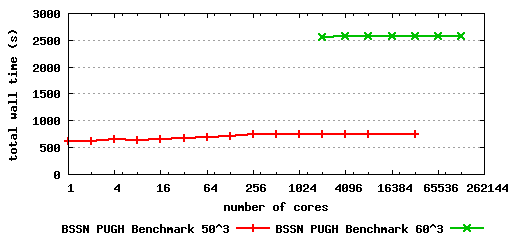

During the [Leap to Petascale
Workshop](https://www.alcf.anl.gov/events/workshops/scaling_workshop08/)
held at the [Argonne Leadership Computing Facility
(ALCF)](http://www.alcf.anl.gov/) in July 2008, the Cactus team
successfully ported the Cactus framework to the Blue Gene/P system at
the [Argonne National Laboratory (ANL)](http://www.anl.gov/) and
conducted benchmarking runs on up to 131,072 cores (out of 163,840 cores
available).

There are two IBM Blue Gene/P systems, [Intrepid and
Surveyor](https://wiki.alcf.anl.gov/index.php/Quick_Reference_Guide),
installed at ANL.  

-   Intrepid has 40,960 quad-core compute nodes (163,840 cores) with a
    peak performance of 557.1 TFlop/s.
-   Surveyor has 1,024 quad-core compute nodes (4096 cores) with a peak
    performance of 13.6 TFlop/s.

Although Intrepid is ranked as the world's third fastest supercomputer
in the [31st TOP500 list](http://top500.org/list/2008/06/100) in June
2008, it is the world's fastest open science supercomputer. The Cactus
team carried out standard weak scaling benchmarking runs with uniform
grid driver PUGH on Intrepid on up to 131,072 cores with a local grid
size of 503 and 603 respectively. The total number
of grid points of the biggest run is 30483 or about 28.3
billion, which is the largest simulation that the Cactus team has ever
performed on any supercomputer so far. The benchmark used is the kernel
of a numerical relativity code which evolves the Einstein equations to
model black holes and gravitational waves. The almost perfect weak
scaling behavior of Cactus on the Blue Gene/P system as shown in the
figure below indicates that Cactus is ready to leap to the Petascale.

We would like to thank Kalyan Kumaran and other ALCF staff members for
their help during the Leap to Petascale Workshop. Our thanks also go to
the on-site IBM support team for their help. As part of the
[XiRel](http://www.nsf.gov/awardsearch/showAward.do?AwardNumber=0701566)
and
[ALPACA](http://www.nsf.gov/awardsearch/showAward.do?AwardNumber=0721915)
projects, this work is supported by the National Science Foundation
under Grant No. 0701566 and 0721915.  

### 16 Aug 2008 — jtao
