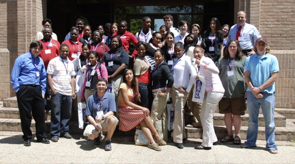
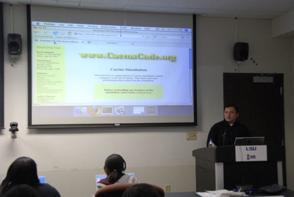
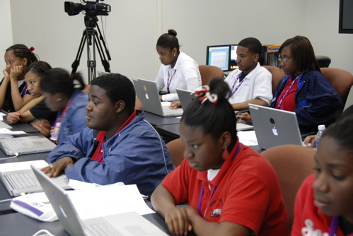

On **April 20**, 2007, the LSU IGERT students and CCT organized a
[workshop](http://www.cct.lsu.edu/IGERT/wiki/index.php/Spring_2007_High_School_Workshop%20)
for 32 Baton Rouge high school students and their teachers.

During the one day workshop that started with presentations by Dr. Ed
Seidel and Dr. Joel Tohline, and ended with a wrap-up talk by Dr.
Gabrielle Allen, the K-12 students took part in two tutorials. Yaakoub
El-Khamra taught them [how to compile and run Cactus in
parallel](/media/presentations/HighSchoolApril20.pdf) on the LONI
supercomputers to simulate the head on collision of black holes, while
the IGERT students showed them how to do scientific visualization using
[Amira](http://www.cct.lsu.edu/IGERT/wiki/index.php/Amira_Tutorial).

------------------------------------------------------------------------

*[CCT Weekly April 22-28, 2007:](http://www.cct.lsu.edu/news/news/252)*

Baton Rouge -- LSU researchers with the National Science Foundation's
Integrative Graduate Education and Research Traineeship, or IGERT,
program and the Center for Computation & Technology, or CCT, hosted a
workshop Friday, April 20, for more than 30 high school students and
their teachers.

The IGERT on Computational Fluid Dynamics at LSU is a National Science
Foundation program that provides doctoral students with an enhanced,
multidisciplinary education and training to prepare them for research in
multiscale computational fluid dynamics and its application to complex
problems in science and engineering.

  ----------------------------------------------------------------------------------------------------------------------------------------------------------------------------------------------------------------------------------------------------------------------------------------------------------------------------------------------------------------------------------------------------------------------------------------------------------------------------------- ---------------------------------------------------------------------------------
  Students from Lee High School and Glen Oaks High School in Baton Rouge attended the IGERT workshop, which took place beginning at 8 a.m. in the Frey Computing Services Center. The workshop introduced students to the tools scientists use to conduct research, particularly those used in high-performance computing for computational fluid dynamics. The workshop was primarily organized by the students in the IGERT program, as part of their training experience at LSU.   [{width="350" height="200"}](HSStudentsWorkshop.jpg)
  ----------------------------------------------------------------------------------------------------------------------------------------------------------------------------------------------------------------------------------------------------------------------------------------------------------------------------------------------------------------------------------------------------------------------------------------------------------------------------------- ---------------------------------------------------------------------------------

CCT Director Ed Seidel began the workshop by talking to the students
about research projects taking place at the center, and showed how
today's computing resources and technology help young science students
gain a better understanding about complex topics than was previously
available. Seidel also gave the students a brief presentation on his
work in numerical relativity, which involves studying black hole
collisions to model gravitational waves. He showed the students several
visualizations of what it looks like when two black holes collide.

CCT and LSU physics Professor Joel Tohline also gave the students a
presentation on what computational fluid dynamics is and how it is
studied at the CCT. Tohline explained that this means studying fluid
flows in nature, which is a significant part of the research in his
"Coast to Cosmos" focus area at CCT.

"To do sophisticated modeling of fluid flow in nature, we need
interdisciplinary research and computational resources," Tohline
explained. He showed varying examples of fluid flow that scientists can
study, ranging from hurricane modeling to flight for birds or airplanes.

  ------------------------------------------------------------------------------------------------------------------------------------------------------------------------------------------------------------------------------------------------------------------------------------------------------------------------------------------------------------------------------------------------------------------------------------------------------------------------------------------------------------------------------------------------------------------------------------- ---------------------------------------------------------------------------------------------
  Following the presentations, the students worked through two tutorials during the workshop. In a visualization tutorial, students learned to visualize results of a glaucoma computer model developed by the LSU Computational Fluid Dynamics group that simulates fluid flow and pressure distribution in the eye using the visualization software tool Amira. Students also took part in a high-performance computing tutorial using the Cactus Framework, running simulations of black holes on the large-scale computing resources of the Louisiana Optical Network Initiative.   [{width="300" height="200"}](CactusTutorialHSWorkshop.jpg)
  ------------------------------------------------------------------------------------------------------------------------------------------------------------------------------------------------------------------------------------------------------------------------------------------------------------------------------------------------------------------------------------------------------------------------------------------------------------------------------------------------------------------------------------------------------------------------------------- ---------------------------------------------------------------------------------------------

One of the main developers of Cactus was CCT researcher Gabrielle Allen,
Ph.D. Cactus has been used for more than 100 research publications in
the field of numerical relativity alone, and is now being extended
partly though the IGERT program to be used for fluid dynamics
applications.

  ----------------------------------------------------------------------------------------- --------------------------------------------------------------------------------------------------------------------------------------------------------------------------------------------------------------------------------------------------------------------------------------------------------------------------------------------------------------------------------------------------------------------------
  [{width="250" height="147"}](HSStudentsWorkshopFrey.jpg)   "These tutorials gave students a chance to get some hands-on experience at working with real scientific research data and tools they could not get in a regular high school classroom setting," Allen said. "Also, through this workshop, the students had the chance to see what computational research is really about. We hope the experience will help inspire them to study science and engineering at university."
  ----------------------------------------------------------------------------------------- --------------------------------------------------------------------------------------------------------------------------------------------------------------------------------------------------------------------------------------------------------------------------------------------------------------------------------------------------------------------------------------------------------------------------

### 22 May 2007 --- elena {#may-2007-elena .align-right}
