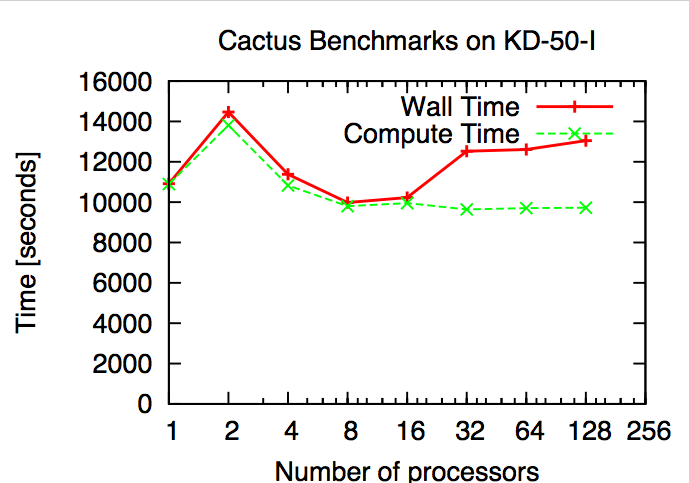

On December 26, 2007, China revealed its first supercomputer of 1
teraflops utilizing the domestic Chinese CPU
[Loongson](http://en.wikipedia.org/wiki/Loongson) 2F at Hefei,
designated as KD-50-I. This supercomputer was designed by a joint team
led by Dr. Chen Guoliang, professor of the Computer Science and
Technology Department of the [University of Science and Technology of
China](http://www.ustc.edu.cn/en/) (the primary contractor, with the
Research Institute of Computational Technology of Chinese Academy of
Sciences as the secondary contractor).

KD-50-I is a diskless cluster with a total of 336 Loongson-2F CPUs
(750MHz) and 1GB memory for each CPU. The operating system is Debian
Linux. The size of the supercomputer is about that of a household
refrigerator and the cost is about $110,000.

Cactus standard testsuites were verified on multiple processors. Several
jobs were run with up to 128 processors. The results are presented on
the graph below. The compute time seemed to scale well while the wall
time seemed to be affected by I/O and other overheads when the number of
processors went beyond 16.

The white cluster is the KD-50-I cluster

    #The MPI compilers/scripts are based on gcc version 4.1.2 20061115 (pre-release) (Debian 4.1.1-21).

    #compilers
    CC               =   mpicc
    LD               =   mpicxx
    CXX              =   mpicxx
    F77              =   mpif77
    F90              =   mpif90

    #compiler flags
    CPPFLAGS = -DMPICH_IGNORE_CXX_SEEK
    FPPFLAGS = -traditional

    #optimization 
    OPTIMISE          =  yes
    C_OPTIMISE_FLAGS  =  -pipe -O2 -finline-functions
    CXX_OPTIMISE_FLAGS=  -pipe -O2 -finline-functions
    F77_OPTIMISE_FLAGS=  -pipe -O2 -finline-functions
    F90_OPTIMISE_FLAGS=  -pipe -O2 -finline-functions

    #warning flags
    C_WARN_FLAGS=  -Wall
    CXX_WARN_FLAGS=-Wall
    F77_WARN_FLAGS=-Wall
    F90_WARN_FLAGS=-Wall

    #debugging flags
    DEBUG=no

    # emable MPI
    MPI=CUSTOM

    LIBS=gfortran

### 3 Feb 2008 — elena
