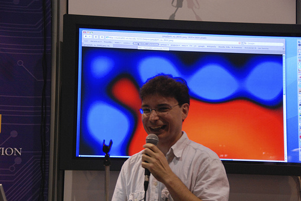
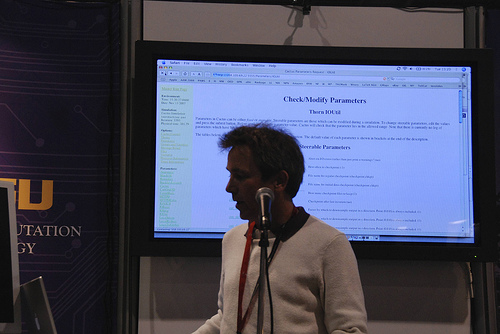
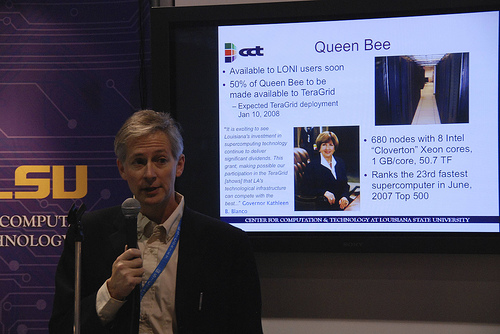

The Cactus Computational Toolkit has been showcased again by the [Center
for Computation & Technology](http://www.cct.lsu.edu)(CCT) researchers
at the annual [Supercomputing Conference
2007](http://sc07.supercomputing.org/) (SC07) from Reno, Nevada. SC07 is
an international conference on high performance computing, networking,
storage and analysis.

The conference is an exciting opportunity for scientists, researchers,
software developers, network engineers, policy makers, corporate
managers, CIOs and IT administrators from universities, industry and
government from all over the world to come together and present their
results and technologies they develop.

Erik Schnetter showed the first large scale runs on
[QueenBee](http://www.hpc.lsu.edu/systems/system.php?system=QueenBee) in
a presentation entitled [Cactus Tools for Petascale
Copmuting](http://www.cct.lsu.edu/~eschnett/doc/Reno-2007-Supercomputing-CactusPetascale.pdf).
Scaling results of the single-node and of all the 668 nodes of the
Einstein Equations can be found in the presentation. At the end, Dr.
Schnetter showed an interactive demo on Queen Bee.

Chris White showed a [UCoMs](http://www.ucoms.org/) demo black oil and
Mayank Tyagi talked about the *Computational Fluid Dynamics Toolkit in
Cactus*.

  --------------------------------------------------
  [{width="50%"}](ErikSC07.jpg)
  Erik Schnetter
  [{width="50%"}](ChrisSC07.jpg)
  Chris White
  [{width="50%"}](EdBeeSC07.jpg)
  Ed Seidel talking about Queen Bee
  --------------------------------------------------

### 10 Jan 2008 --- elena {#jan-2008-elena .align-right}
