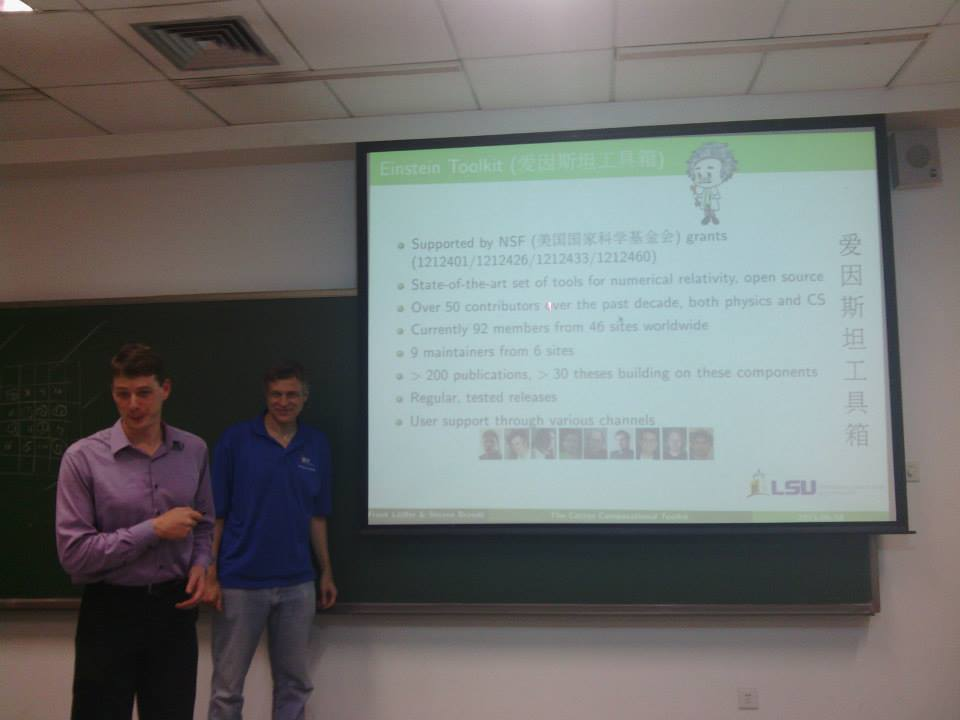
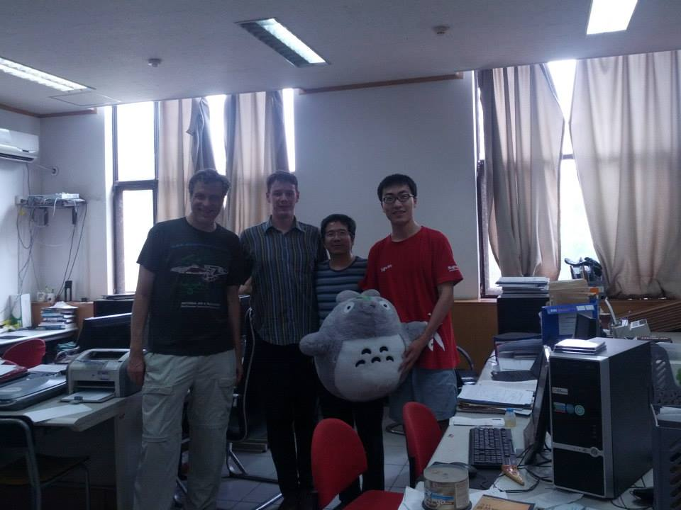

"仙人掌：高性能计算开源框架" (Cactus: An open-source framework for
high-performance computing): That was the title of one of the four
invited talks presented by Steven R. Brandt and Frank Löffler this year
in Beijing, China.

The two leaders of the Cactus project travelled to [Tsinghua
University](http://www.tsinghua.edu.cn/publish/then/) to visit 都志辉
(Zhihui Du), associate professor at the Department of Computer Science
and Technology.

Brandt and Löffler presented Cactus and the [Einstein
Toolkit](http://einsteintoolkit.org/) to faculty of the [Department of
Computer Science and
Technology](http://www.tsinghua.edu.cn/publish/csen/) at Tsinghua
University, at the [State Key Laboratory of Scientific and Engineering
Computing (LSEC)](http://lsec.cc.ac.cn/), at the [Institute of Applied
Physics and Computational Mathematics](http://www.iapcm.ac.cn/), and to
a high-performance-computing class at Tsinghua University.

This visit and these talks mark the beginning of a scientific
collaboration. We made a joint proposal for computer time on Titan, and
are planning a scientific paper in the near future.

### 12 July 2013 — sbrandt/knarf
