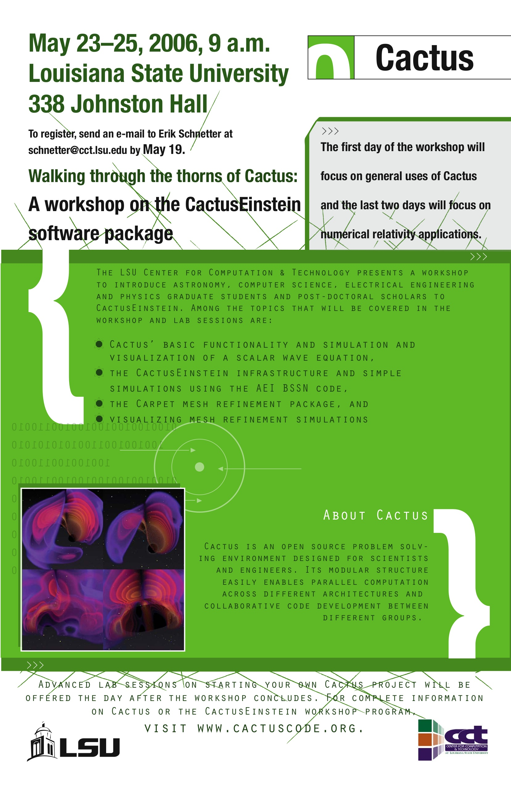

### CactusEinstein Workshop

Location: Baton Rouge, LA  
**Date: May 23 to May 25, 2006**

The CCT offers a CactusEinstein workshop from May 23 to May 25, 2006.
The aim of this workshop is to introduce physicists to [mesh refinement
methods](http://www.carpetcode.org/), to the [CactusEinstein
infrastructure](/documentation/arrangements/CactusEinstein.pdf), and to
some visualisation tools. This workshop includes extended lab sessions.
It is oriented towards graduate students and post-doctoral scholars with
no or little experience with Cactus.

The CactusEinstein infrastructure is a numerical relativity toolkit
which is based on Cactus. It consists of a set of common definitions
e.g. for variable names and file formats which lets different numerical
relativity codes interact. The CactusEinstein infrastructure contains
also a set of simple modules e.g. for initial data, time evolution,
constraint evaluation, wave extraction, and horizon finding.

In the course of this workshop, the participants will get to know Cactus
and CactusEinstein. They will learn to use some existing codes that are
based on Cactus and CactusEinstein, and will learn how to write simple
codes themselves. The AEI and the CCT make many Cactus thorns publicly
available, e.g. a complete production level BSSN implementation,
efficient apparent and event horizon finders, higher order finite
differencing operators, and non-trivial initial data for single and
binary black hole simulations.

There is no registration fee. If you plan to attend, please send email
to  [Erik Schnetter](mailto:schnetter@cct.ls.edu)
before May 1. Please specify the dates at which you plan to attend,
whether you are interested in the lab sessions, and whether you would
maybe like to present a talk or a poster. Please indicate also if you
want help in finding accommodation.

The workshop programme is here
([Programme](http://wiki.cct.lsu.edu/numrel/space/Events/CactusEinstein_2006/Programme))
and a detailed schedule is here
([Schedule](http://wiki.cct.lsu.edu/numrel/space/Events/CactusEinstein_2006/Schedule)).
The list of software packages for the lab sessions is here
([Software](http://wiki.cct.lsu.edu/numrel/space/Events/CactusEinstein_2006/Software)).
The slides of the presentations are here
([Slides](http://wiki.cct.lsu.edu/numrel/space/Events/CactusEinstein_2006/Slides)).

### 28 Jun 2006 — jeffd
