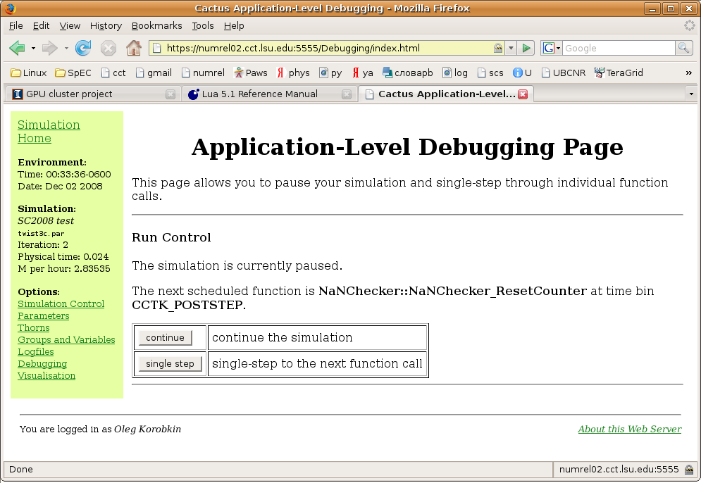

At the recent [2008 Supercomputing
conference](http://sc08.supercomputing.org/) in Austin, the LSU Center
for Computation and Technology booth provided a showcase for two new
remote debugging tools currently developed as part of the
[ALPACA](http://www.cct.lsu.edu/~eschnett/Alpaca/) project: VisitConnect
and HTTPS.

VisitConnect is a module that provides running Cactus simulations with
the capability to expose their mesh and data structures to the
visualization package VisIt. Leveraging on VisIt's functionalities, the
module allows for remote visualization and simulation control through
pause, restart and single-step commands.

HTTPS implements simulation control through HTTP access to the
simulation host. The controls allow a simulation to be paused and
examined at the level of a single function call. It can be used, for
instance, to determine which function causes simulation to crash, or to
check if the actual order of functions execution is correct. It is a
good starting point for different interesting visualization and
debugging functionalities.

### 16 Dec 2008 — bentivegna
