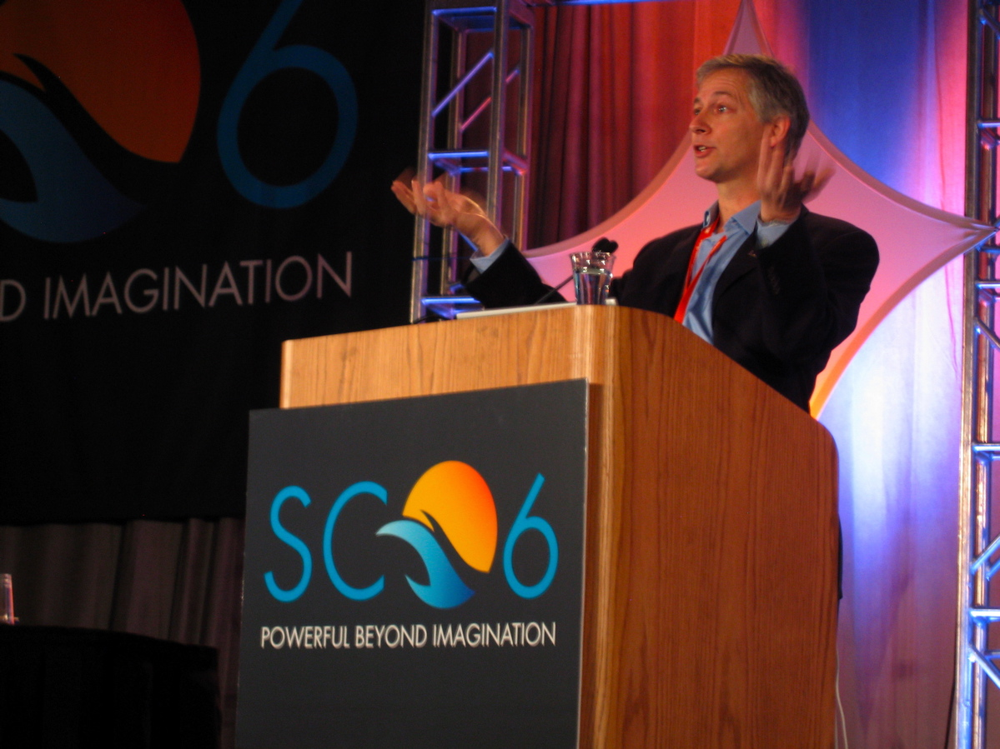

**November 2006:**

|                                                                                                                                                                                                                                                                                                                                                                                                                                                                                                                                                              |                                                                                                                                                                                                                     |
|--------------------------------------------------------------------------------------------------------------------------------------------------------------------------------------------------------------------------------------------------------------------------------------------------------------------------------------------------------------------------------------------------------------------------------------------------------------------------------------------------------------------------------------------------------------|---------------------------------------------------------------------------------------------------------------------------------------------------------------------------------------------------------------------|
| Ed Seidel won the 2006 Sidney Fernbach Award for his work with Cactus and Black Holes. He received one of the highest honors in computational science at the annual Supercomputing Conference in Tampa, Fla. on Nov. 15. Seidel gave a keynote address on his research at the conference. He was honored for his work to develop collaborative, high-performance computing approaches to solve complex problems in physics, such as Einstein’s equations of general relativity, specifically for colliding black holes, which was the subject of his speech. |  [Ed talking about Cactus](http://www.cct.lsu.edu/~gallen/Movies/SeidelCactus.avi) (-a movie of 194 MB!) |

In his speech, Seidel discussed how developing the software needed to
solve these problems has advanced breakthroughs in grid computing and
high-performance computing for other academic disciplines with similar
complex challenges, such as fluid dynamics and coastal sciences.

Using the high-performance software that Seidel and the CCT researchers
developed to model black hole collisions will enable researchers to make
predictions on what gravitational waves would look like, and the
supercomputing technology at CCT allows teams of researchers from
different fields to work together at mapping the collisions.

Offering scientists a model for understanding what gravitational waves
from black hole collisions look like will ultimately lead to
breakthroughs in physics and astronomy, Seidel said.

Among the past recipients are John B. Bell (2005), Jack J. Dongarra
(2003), Michael L. Norman (1999) and Phillip Collela (1998). [*(Source
CCT Weekly)*](http://www.cct.lsu.edu/news/news/155)

[Download Ed's presentation](/media/presentations/SC06Seidel.pdf)

[See SC06 flyer for Sidney Fernbach Award.](/media/presentations/sc06_1)

------------------------------------------------------------------------

[LSU
Article](http://appl003.lsu.edu/UNV002.nsf/PressReleases/PR4052?OpenDocument):

*There are only a handful of awards in the computational sciences that
mark career achievements. Edward Seidel, director of LSU's Center for
Computation and Technology, or CCT, has just received one of the most
prestigious honors, the Sidney Fernbach Award.*

Given by the Institute of Electrical and Electronics Engineers, or IEEE,
computer society, this international award recognizes outstanding
contributions in the application of high-performance computers using
innovative approaches. It was established in 1992 in memory of Sidney
Fernbach, one of the pioneers in the development and application of
high-performance computers for the solution of large computational
problems.

The Fernbach Prize is one of the most coveted in the field of computer
science. The IEEE computer society recognized Seidel for outstanding
contributions to the development of software for high-performance
computing and grid computing to enable the collaborative numerical
investigation of complex problems in physics, particularly focusing on
modeling black hole collisions.

Seidel's successful work in numerical relativity, the mathematical
investigation of relativity through the solution of Einstein's
equations, has been aided by technologies and methods developed by
Seidel and his teams of researchers throughout the past several years.

For example, he realized early on that instead of using a specific
algorithm to solve a particular form of the Einstein equations, he could
develop a general approach to solving a broad set of partial
differential equations with a wide variety of algorithms. However, to
accomplish this, he needed a more multi-faceted tool. This led to the
development of the Cactus ToolKit, a comprehensive, modular tool for
high performance computing. Cactus is now used in many scientific
applications that have complex problems to solve. Similarly, Seidel
found that his research would be greatly enhanced by using multiple
supercomputing resources to solve very complex, computationally intense
problems. He and his research team pursued solving these equations using
supercomputers in different locations simultaneously, which led to
breakthroughs in the field of grid computing.

Seidel's career is marked by a history of risk-taking experimentation
that has paid huge dividends in scientific discovery. His scientific
legacy combines an extraordinary grasp of very complex concepts, with a
keen eye for the uses of technology and the ability to inspire diverse
groups of researchers, scientists and students to lend the full range of
their expertise to solving complex problems in novel and groundbreaking
ways. It is this level of leadership that makes his work one of the best
examples of the success of LSU's Flagship Agenda.

### 15 Nov 2006
