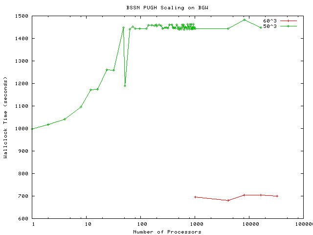

**November 2005:** The Cactus team was recently given access to the
BlueGene/L machine at the IBM TJ Watson Research Center to conduct
benchmarking runs.

Using a standard benchmark which the team has used across a number of
architectures, Cactus, with the PUGH driver, showed a linear speedup for
a weak scaling problem to the limit of the CPUs available, and with no
detectable loss of scaling efficiency for high processor numbers.

These results strongly suggest that this application would be able to
scale to the largest machines available at this time, thus allowing
physicists using Cactus to conduct simulations with exceptional
accuracy.

Here is [the data](bssnpugh.txt) we used with the [gnuplot
script](Scaling_BSSN_PUGH_script.txt) to generate the scaling graph of
the BSSN\_PUGH on BlueGene/L (BGW).

### 29 Jan 2007 — elena
