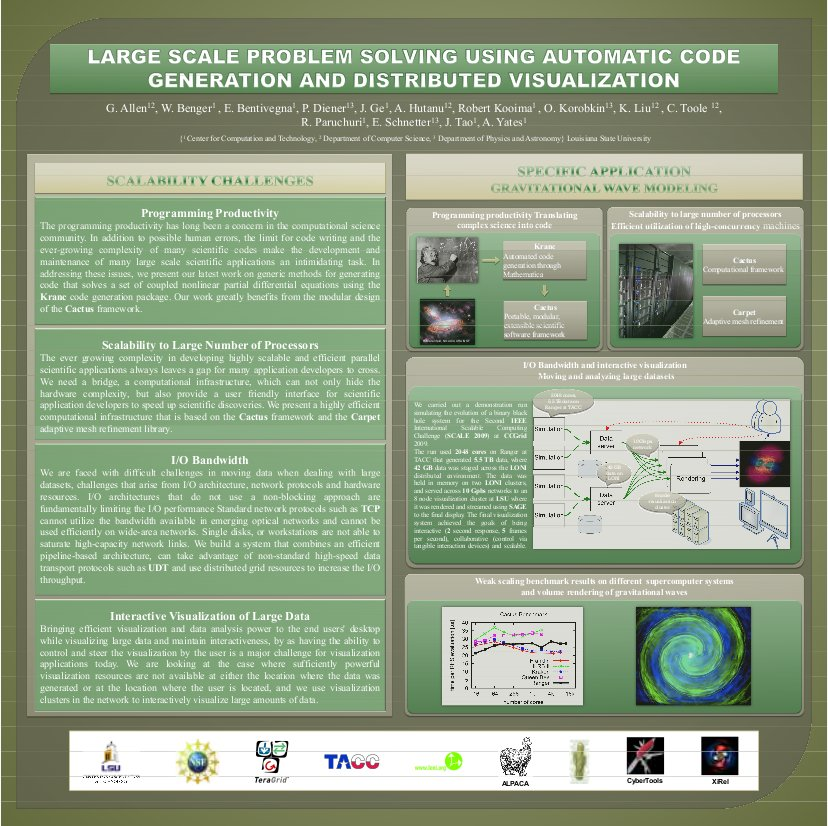
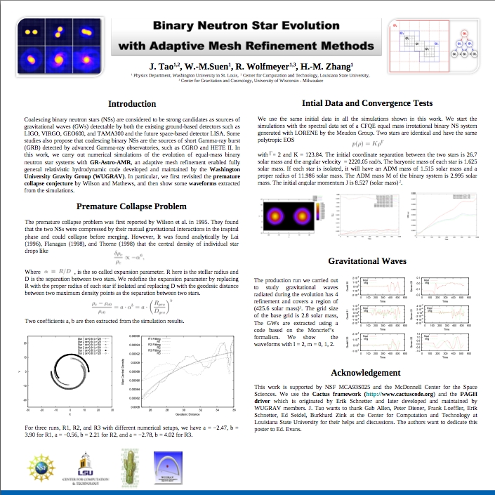
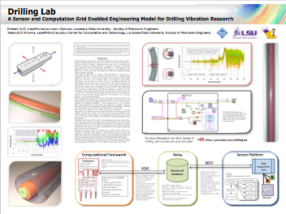
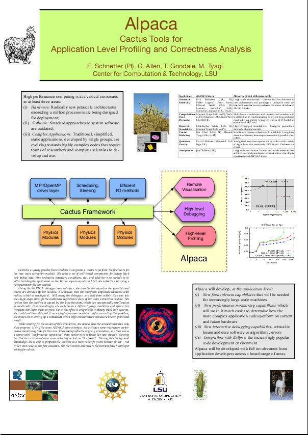
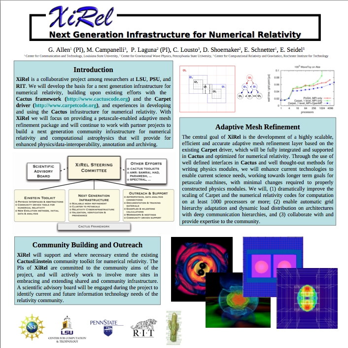

Posters and Videos
==================

2009

*Large Scale Problem Solving Using Automatic Code Generation and
Distributed Visualization*G. Allen, W. Benger, E. Bentivegna, P. Diener,
J. Ge, A. Hutanu, R. Kooima, O. Korobkin, K. Liu, C. Toole, R.
Paruchuri, E. Schenetter, J. Tao, and A. Yates, ICCS 2009, Baton Rouge,
LA, USA.

2008

*Binary Neutron Star Evolution with Adaptive Mesh Refinement Methods.*
J. Tao, W.-M. Suen, R. Wolfmeyer and H.-M. Zhang, American Physical
Society Meeting, April 2008, St. Louis, Mo., USA.

*Drilling Lab - A Sensor and Computation Grid Enabled Engineering Model
for Drilling Vibration Research.* Richard Duff and Yaakoub El Khamra,
Mardi Gras Conference 2008, Baton Rouge, La., USA.

2007

*Alpaca: Cactus Tools for Application Level Profiling and Correctness
Analysis.* E. Schnetter, G. Allen, T. Goodale and M. Tyagi, Building
Petascale Applications and Software Environments on the Teragrid
Workshop, December 11-12, 2007, Arizona State University, Tempe, Az.,
USA.

*Next Generation Infrastructure for Numerical Relativity.* G. Allen, M.
Campanelli, P. Laguna, C. Lousto, D. Shoemaker, E. Schnetter and E.
Seidel, CBuilding Petascale Applications and Software Environments on
the Teragrid Workshop, December 11-12, 2007, Arizona State University,
Tempe, Az., USA.

*[Tackling the Riddles of Gravity (Visions of Space
Time)](http://www.youtube.com/watch?v=SFUG6itL_0M).* Video compilation
and direction: Werner Benger, 2003.
