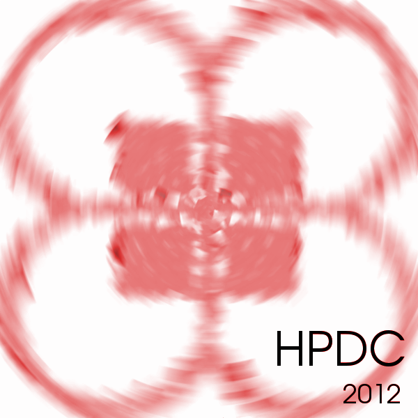
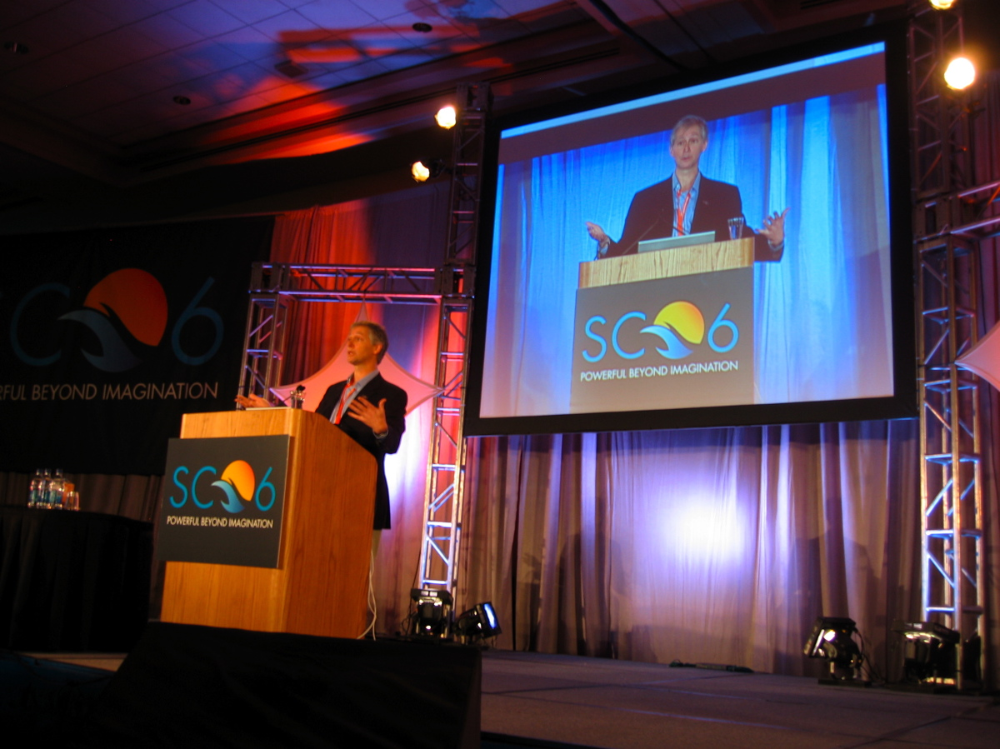
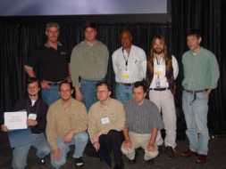
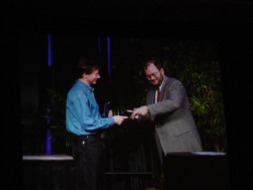
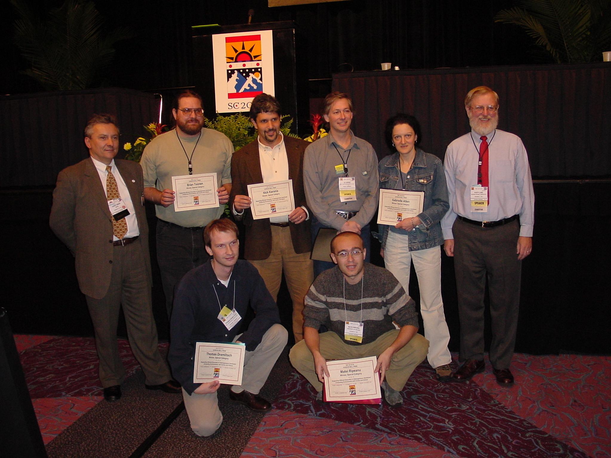
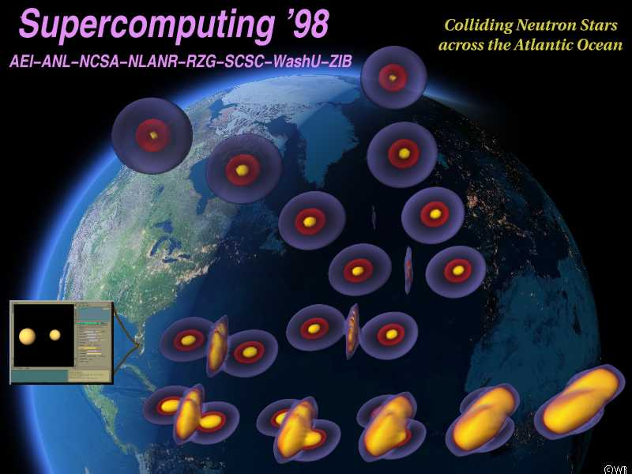
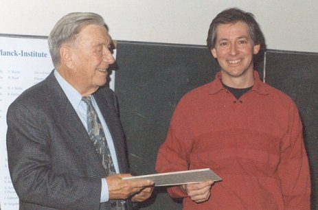

Over the years, Cactus and its developers have won some of high
performance computing's most prestigious awards. Several are presented
on this page.

-   [Cactus Receives 2012 HPDC
    Award](http://www.cct.lsu.edu/news/lsu-cct-receives-top-paper-award-hpdc)
      
    A research paper whose co-authors include LSU's Gabrielle Allen,
    Werner Benger, Andrew Merzky, and Ed Seidel has been named by the
    International ACM Symposium on High-Performance Parallel and
    Distributed Computing (HPDC) as one of the top 20 papers in the past
    20 years of publications. HPDC is the premier computer science
    conference for presenting new research related to high-performance
    parallel and distributed systems used in both science and industry.
    Since its inception, HPDC has been at the center of new discoveries
    in systems such as clusters, grids, clouds, and parallel and
    multicore computers.

-   [IEEE Sidney Fernbach
    Award (2006)](http://awards.computer.org/ana/award/viewPastRecipients.action?id=16)
      
    Dr. Edward Seidel has been awarded one of the most prestigious
    awards for "outstanding contributions in the application of high
    performance computers using innovative approaches". The IEEE
    computer society recognized Seidel for outstanding contributions to
    the development of software for high-performance computing and grid
    computing to enable the collaborative numerical investigation of
    complex problems in physics, particularly focusing on modeling black
    hole collisions.  
      
    More information in the [news story](/media/news/SidneyFernbach06/).

-   [High-Performance Bandwidth Challenge
    (SC2002)](http://www.sc-conference.org/sc2002/infra_band.html)
      
    The LBNL/NCSA team has won the "Highest Performing Application"
    award at SuperComputing 2002 with the Cactus based application “Wide
    Area Distributed Simulations using Cactus, Globus and Visapult”. The
    wininig application transfers data at 16 GByte/s, modeling
    gravitational waves generated during the collision of black holes.

-   [High-Performance Computing Challenge Award
    (SC2002)](http://www.sc-conference.org/sc2002/infra_band.html)
      
    The Cactus team were a core part of the Global Grid Testbed
    Collaboration, who won both the "Most Geographically Distributed
    Application" and "Most Heterogeneous Set of Platforms" prizes at
    SC2002 for a task farming application written with Cactus which
    deployed Cactus Black Hole simulations across 70 diverse machines in
    12 different countries.

-   [Gordon Bell Prize for Supercomputing
    (SC2001)](http://www.sc2001.org/PR-20011115.shtml)
      
    The Cactus team were a core part of the Global Grid Testbed
    Collaboration, who won both the "Most Geographically Distributed
    Application" and "Most Heterogeneous Set of Platforms" prizes at
    SC2002 for a task farming application written with Cactus which
    deployed Cactus Black Hole simulations across 70 diverse machines in
    12 different countries.

-   [HPC “Most Stellar” Challenge Award
    (SC1998)](http://jean-luc.aei.mpg.de/Projects/SC98/)
      
    "Cactus 3.0" won the Most Stellar HPC Challenge Award at SC1998. The
    Cactus framework was used to perform a full three-dimensional
    simulation of colliding neutron stars based on Einstein's equations.
    The simulation was distributed across two continents spanning the
    computational grid among three T3E's in Garching (Germany), Berlin
    (Germany), and SDSC (United States).

-   [Heinz Billing Prize for Scientific
    Computing (1998)](http://www.billingpreis.mpg.de/)
      
    The Heinz Billing Prize 1998 was awarded to Edward Seidel in
    recognition of his group's work in scientific computing including
    the Cactus Code. This award is given by the Heinz Billing Society to
    promote scientific computing within the Max Planck Society.

  
