Visualization Credits: [Werner Benger](http://www.cct.lsu.edu/~werner/),
CCT  
Software Credits:

-   [Amira](http://amira.zib.de/)

<!-- -->

-   [VISH](http://vish.origo.ethz.ch)

<!-- -->

-   [Light++ Raytracer](http://www.photon.at/~werner/light/)

|                                                                                    |                                                                                                                                                                                                                                                                                        |     |
|------------------------------------------------------------------------------------|----------------------------------------------------------------------------------------------------------------------------------------------------------------------------------------------------------------------------------------------------------------------------------------|-----|
| [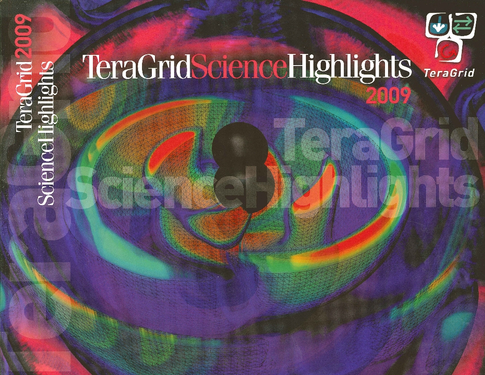](TGhighlights.jpg)                     | Erik Schnetter, *Catching Waves*, TeraGrid Science Highlights 2009                                                                                                                                                                                                                     |     |
| [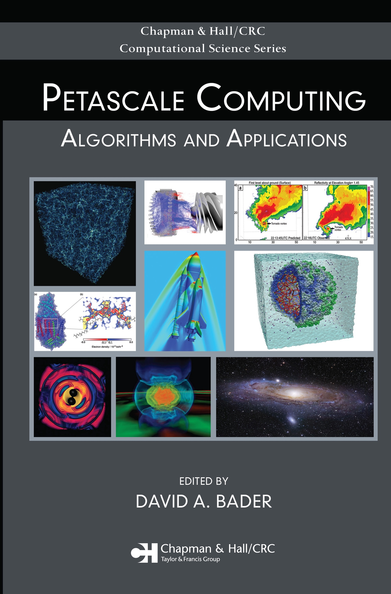](PetascaleComputingBook.jpg) | Erik Schnetter, Christian Ott, Gabrielle Allen, Peter Diener, Tom Goodale, Thomas Radke, Edward Seidel, John Shalf, *Cactus Framework: Black Holes to Gamma Ray Bursts, to appear as a chapter in Petascale Computing: Algorithms and Applications*, Ed. D. Bader, CRC Press LLC, 2007 |     |
| [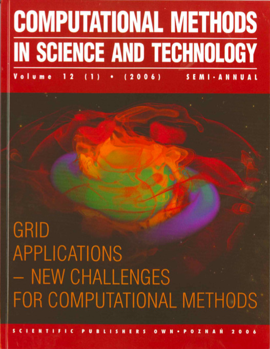](CompMethSciTech.jpg)               | *Grid Applications - New Challenges For Computational Methods.* Computational Methods in Science and Technology, Volume 12 (1), 2006                                                                                                                                                   |     |
| [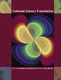](nsffy2006budgetcover.jpg)     | *Gravitational waves from in-spiraling black holes in NSF FY 2006 Budget Request to Congress.* Ed Seidel, LSU; Max Planck Institute for Gravitational Physics (Albert Einstein Institute), 2006                                                                                        |     |
| [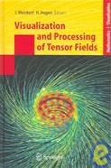](visprocessingtensor.jpg)       | *Strategies for Direct Visualization of Second-Rank Tensor Fields, in Visualization and Processing of Tensor Fields*, J. Weickert, H. Hagen (eds.), Chapter 11, Springer Verlag, pp. 191-214, 2006                                                                                     |     |
| 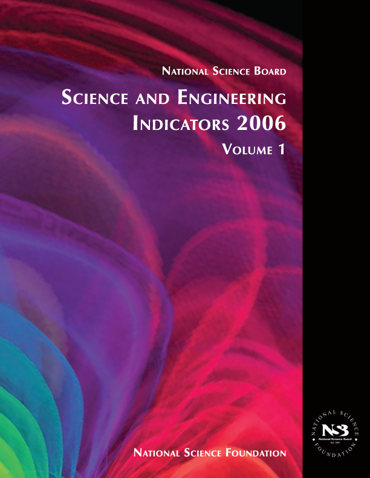                                              | National Science Board, *Science and Engineering Indicators*, Volume 1, National Science Foundation, 2006                                                                                                                                                                              |     |
| [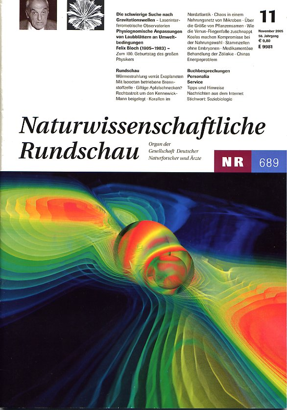](NR689.jpg)                                   | *Naturwissenschaftliche Rundschau.* 689, November, 2005                                                                                                                                                                                                                                |     |
|            | Maxine Brown, *Blueprint for the future of high-performance networking*. Communications of the ACM (CACM), 46(11), 2003                                                                                                                                                                |     |
| 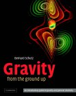                                              | Bernard Schutz, *Gravity from the Ground Up: An Introductory Guide to Gravity and General Relativity*, Cambridge University Press, 2003                                                                                                                                                |     |
|                                    | G. W. Gibbons, E. P. S. Shellard, S. J. Rankin, *The Future of Theoretical Physics and Cosmology*, Cambridge University Press, 2003                                                                                                                                                    |     |
| [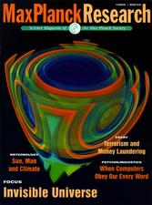](max-planck-research2.jpg)     | Max Planck Research, *Collisions that Make Waves in Space*, Volume 1, p.43, 2002.                                                                                                                                                                                                      |     |
| 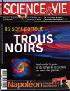                                           | *Trous Noirs*, Science & Vie, 2002                                                                                                                                                                                                                                                     |     |
| [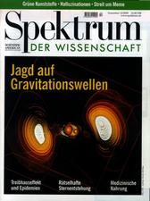](spektrum.jpg)                             | *Spektrum der Wissenschaften - Jagd auf Gravitationswellen*, 2000                                                                                                                                                                                                                      |     |
| [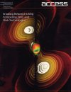](Access99.jpg)                             | Karen Green, *Colliding with a Supercomputing Record*, Access magazine (alliance/NCSA), 12(3), 1999.                                                                                                                                                                                   |     |
| [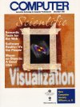](IEEEComputer.jpg)                     | Gabrielle Allen, Tom Goodale, Gerd Lanfermann, Thomas Radke, Ed Seidel, Werner Benger, H. Hege, Andre Merzky, Joan Masso and John Shalf. *Solving Einstein's Equation on Supercomputers*. IEEE Computer, 32(12):52–59, 1999                                                            |     |
| [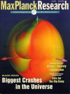](MPR99.jpg)                                   | Uwe Seidenfaden. *Biggest Crashes in the Universe*. Max-Planck-Research Notes, 1999                                                                                                                                                                                                    |     |
