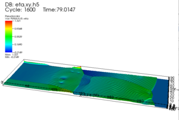
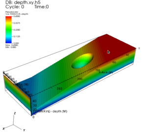
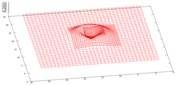

CaFunwave is a Thorn which enables simulation of Boussinesq or shallow
water equations. CaFunwave is based on the
[Funwave](http://chinacat.coastal.udel.edu/programs/funwave/funwave.html)
made available by the University of Delaware.

[DOWNLOAD](download.php)

Complete parameter listing: [Funwave Parameters](params.php)

  ---------------------------------
  
  
  
  ---------------------------------

**Current version:** FW\_2012\_11

**Developers of CaFunwave:** Steven R. Brandt, Frank Loeffler, Jian Tao,
Fengyan Shi, Terrance K. Pat, and Qin Chen
